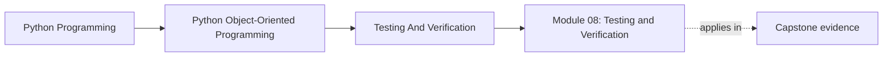

# Module 08: Testing and Verification

<!-- page-maps:start -->
## Page Maps

<!-- page-maps:end -->

Strong object models still need executable proof. This module turns testing from a
generic quality ritual into a design tool for verifying state transitions, repository
contracts, adapter behavior, and long-term confidence in an object-oriented Python system.

Keep one question in view while reading:

> Which test would fail first if this ownership boundary or lifecycle rule stopped being true?

That question turns verification into design evidence instead of test-count theater.

## Why this module matters

Object-heavy systems often fail in ways that shallow unit tests miss:

- invalid transitions only appear after several state changes
- repositories round-trip happy paths but corrupt edge cases
- mocks hide interface drift instead of exposing it
- snapshots freeze accidental representation details

This module teaches how to verify object contracts honestly, not just how to increase
test count.

## Main questions

- Which tests should target domain behavior, and which should target boundaries?
- How do you cover stateful lifecycles and cross-object invariants?
- When do contract tests, property-based tests, and integration suites pay off?
- How do assertion boundaries and runtime checks support design clarity?
- What creates justified confidence instead of decorative green builds?

## Reading path

1. Start with behavior-first tests, stateful coverage, and repository contracts.
2. Then study property-based testing, test data ownership, and doubles.
3. Finish with runtime checks, approval boundaries, and confidence ladders.
4. Use the refactor chapter to reshape the capstone test suite around contracts instead of convenience.

## Common failure modes

- testing internal method calls instead of externally visible behavior
- using brittle mocks where a fake or contract test would be clearer
- reusing fixtures that hide the real setup needed for an invariant
- snapshotting unstable representations and calling it regression protection
- assuming a passing unit test layer means production workflows are covered

## Capstone connection

The monitoring capstone already includes unit and application tests. This module shows
how to extend that suite toward stateful lifecycle coverage, repository contracts,
property checks, and confidence layers that match real design risk.

## Outcome

You should finish this module able to construct a verification strategy that matches the
semantic and operational risk of an object-oriented Python codebase rather than relying
on one default style of test everywhere.
