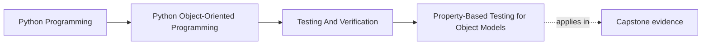

# Property-Based Testing for Object Models

<!-- page-maps:start -->
## Page Maps

<!-- page-maps:end -->

## Purpose

Use generated inputs to test invariants, round-trips, and state rules that are awkward
to cover by hand.

## 1. Properties Expose Design Intent

Examples of useful properties:

- serialization round-trips preserve meaning
- equality is reflexive and symmetric
- activating then retiring leaves no active rule behind
- sorted order respects comparison semantics

Properties force you to articulate what must always hold.

## 2. Generated Data Finds Edge Cases You Did Not Imagine

Handwritten examples often cluster around obvious inputs. Property-based tools explore
unexpected values, ordering, and sequence combinations that trigger hidden bugs.

## 3. Strategy Design Matters

Generated data should respect the domain enough to reach meaningful code paths. If all
inputs are invalid junk, you learn little. Build strategies that reflect real shapes and
explicitly include edge cases you care about.

## 4. Shrinking Improves Debuggability

A good property-based test leaves you with a small failing example when an invariant
breaks. That makes design flaws easier to reason about and fix.

## Practical Guidelines

- Use properties for invariants, round-trips, algebraic behavior, and lifecycle rules.
- Build generators that match the domain instead of random primitive noise.
- Keep properties focused on one clear invariant each.
- Review failing shrunk examples as design feedback, not just test failures.

## Exercises for Mastery

1. Add one round-trip or equality property to a value object.
2. Generate valid and invalid states deliberately for one lifecycle type.
3. Review one existing test and decide whether a property would express it better.
