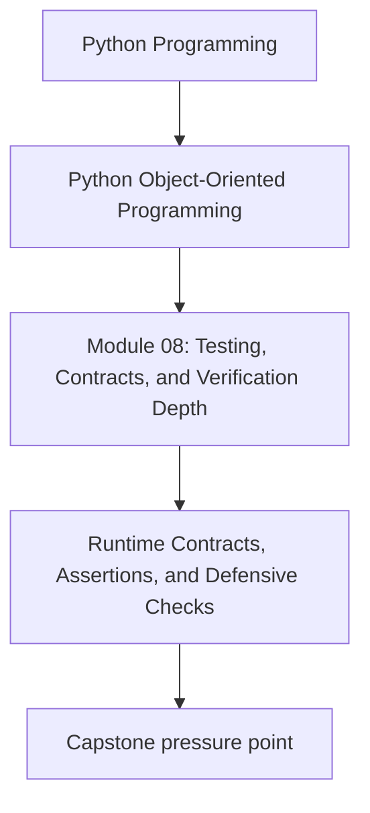
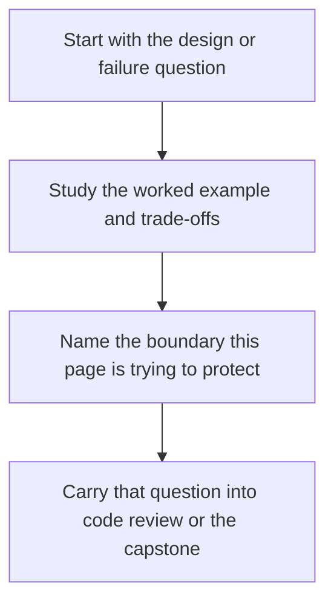

# Runtime Contracts, Assertions, and Defensive Checks

<!-- page-maps:start -->
## Concept Position

<!-- page-maps:end -->

Read the first diagram as a placement map: this page is one concept inside its parent module, not a detached essay, and the capstone is the pressure test for whether the idea holds. Read the second diagram as the working rhythm for the page: name the problem, study the example, identify the boundary, then carry one review question forward.

## Purpose

Use runtime checks to support design clarity and debugging without confusing them with a
complete verification strategy.

## 1. Assertions Document Assumptions

Assertions are useful when they express an invariant that should be impossible to break
if surrounding code is correct. They help localize failures close to the source.

## 2. Domain Errors and Assertions Have Different Roles

Use domain errors for invalid caller actions or boundary violations.
Use assertions for internal assumptions that represent programmer mistakes or corrupted flow.

## 3. Defensive Checks Belong at Important Boundaries

Repository loads, codec parsing, adapter responses, and plugin registration often
benefit from explicit checks that reject malformed or unsupported inputs early.

## 4. Checks Need Tests Too

If a runtime check guards an important invariant, add a test or at least a documented
failure path. Otherwise it becomes dead decoration.

## Practical Guidelines

- Distinguish caller-facing validation from internal assertions.
- Place defensive checks at boundaries where bad data can enter.
- Keep assertion messages specific enough to speed diagnosis.
- Test important invariant checks and malformed-input rejections.

## Exercises for Mastery

1. Convert one vague assertion into a clearer invariant statement.
2. Add a boundary check for one malformed payload or unsupported plugin.
3. Review whether one runtime check should really be a caller-facing domain error instead.
