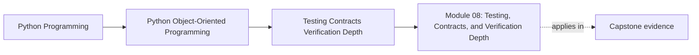

# Module 08: Testing, Contracts, and Verification Depth

<!-- page-maps:start -->
## Page Maps

<!-- page-maps:end -->

Read the first diagram as a placement map: this page sits between the course promise, the lesson pages listed below, and the capstone surfaces that pressure-test the module. Read the second diagram as the study route for this page, so the diagrams point you toward the `Lesson map`, `Exercises`, and `Closing criteria` instead of acting like decoration.

Strong object models still need executable proof. This module turns testing from a
generic quality ritual into a design tool for verifying state transitions, repository
contracts, adapter behavior, and long-term confidence in an object-oriented Python system.

Keep one question in view while reading:

> Which test would fail first if this ownership boundary or lifecycle rule stopped being true?

That question turns verification into design evidence instead of test-count theater.

## Preflight

- You should already be able to name the ownership and lifecycle rules that deserve proof.
- If tests still feel like a separate discipline from design, read this module with one capstone invariant in mind.
- Keep asking which test surface would fail first if a boundary, transition, or repository contract drifted.

## Learning outcomes

- design verification layers that match domain, boundary, and operational risk instead of defaulting to one style
- choose between behavioral, property-based, contract, and integration tests with explicit justification
- expose lifecycle, repository, and adapter failures that shallow happy-path tests would miss
- use runtime checks and approval boundaries to support executable design claims

## Why this module matters

Object-heavy systems often fail in ways that shallow unit tests miss:

- invalid transitions only appear after several state changes
- repositories round-trip happy paths but corrupt edge cases
- mocks hide interface drift instead of exposing it
- snapshots freeze accidental representation details

This module teaches how to verify object contracts honestly, not just how to increase
test count.

## Main questions

- Which tests should target domain behavior, and which should target boundaries?
- How do you cover stateful lifecycles and cross-object invariants?
- When do contract tests, property-based tests, and integration suites pay off?
- How do assertion boundaries and runtime checks support design clarity?
- What creates justified confidence instead of decorative green builds?

## Reading path

1. Start with behavior-first tests, stateful coverage, and repository contracts.
2. Then study property-based testing, test data ownership, and doubles.
3. Finish with runtime checks, approval boundaries, and confidence ladders.
4. Use the refactor chapter to reshape the capstone test suite around contracts instead of convenience.

## Lesson map

- [Behavior-First Tests for Domain Objects](behavior-first-tests-for-domain-objects.md)
- [Stateful Testing and Transition Coverage](stateful-testing-and-transition-coverage.md)
- [Contract Tests for Repositories and Adapters](contract-tests-for-repositories-and-adapters.md)
- [Property-Based Testing for Object Models](property-based-testing-for-object-models.md)
- [Fixtures, Builders, and Test Data Ownership](fixtures-builders-and-test-data-ownership.md)
- [Fakes, Stubs, Spies, and When Mocks Hurt](fakes-stubs-spies-and-when-mocks-hurt.md)
- [Runtime Contracts, Assertions, and Defensive Checks](runtime-contracts-assertions-and-defensive-checks.md)
- [Golden Files, Snapshots, and Approval Boundaries](golden-files-snapshots-and-approval-boundaries.md)
- [Integration Suites and Confidence Ladders](integration-suites-and-confidence-ladders.md)
- [Refactor: Tests toward Contract-Driven Confidence](refactor-tests-toward-contract-driven-confidence.md)
- [Glossary](glossary.md)

## Keep these support surfaces open

- `../guides/proof-matrix.md` when you want each verification claim tied to one evidence route.
- `../guides/proof-ladder.md` when you need to size proof honestly instead of defaulting to the strongest route.
- `../reference/self-review-prompts.md` when you want to test whether a proof claim now sounds like a design judgment instead of a testing slogan.

## Verification route by claim

| If the claim is about... | Start with | Then compare |
| --- | --- | --- |
| lifecycle and invariant authority | [Capstone Proof Guide](../capstone/capstone-proof-guide.md) and lifecycle tests | [Capstone Review Worksheet](../capstone/capstone-review-worksheet.md) |
| replaceable policy behavior | evaluation tests | `policies.py` and [Capstone File Guide](../capstone/capstone-file-guide.md) |
| public-facing use cases | application or demo tests | [Capstone Walkthrough](../capstone/capstone-walkthrough.md) and [Command Guide](../capstone/command-guide.md) |
| runtime or repository boundaries | runtime or unit-of-work tests | [Capstone Architecture Guide](../capstone/capstone-architecture-guide.md) and [Capstone File Guide](../capstone/capstone-file-guide.md) |

## If verification still feels abstract

- name the design claim before choosing the test family
- ask which suite should fail first, not which suite is most impressive to run
- compare one saved review bundle with one targeted suite so story and contract stay connected

## Common failure modes

- testing internal method calls instead of externally visible behavior
- using brittle mocks where a fake or contract test would be clearer
- reusing fixtures that hide the real setup needed for an invariant
- snapshotting unstable representations and calling it regression protection
- assuming a passing unit test layer means production workflows are covered

## Exercises

- Take one ownership boundary and name the first test that should fail if that boundary stops being true.
- Compare a mock-heavy test with a fake or contract test and explain which one would better expose interface drift.
- Review one fixture or snapshot and explain whether it clarifies the invariant or hides the setup needed to understand it.

## Capstone connection

The monitoring capstone already includes unit and application tests. This module shows
how to extend that suite toward stateful lifecycle coverage, repository contracts,
property checks, and confidence layers that match real design risk.

## Honest completion signal

You are ready to move on when you can take one design claim from the capstone and answer:

- which suite should fail first
- which saved route best explains the same claim to a human reviewer
- which proof route would be unnecessarily heavy for that question

## Closing criteria

You should finish this module able to construct a verification strategy that matches the
semantic and operational risk of an object-oriented Python codebase rather than relying
on one default style of test everywhere.

## Directory glossary

Use [Glossary](glossary.md) when you want the recurring language in this module kept stable while you move between lessons, exercises, and capstone checkpoints.
