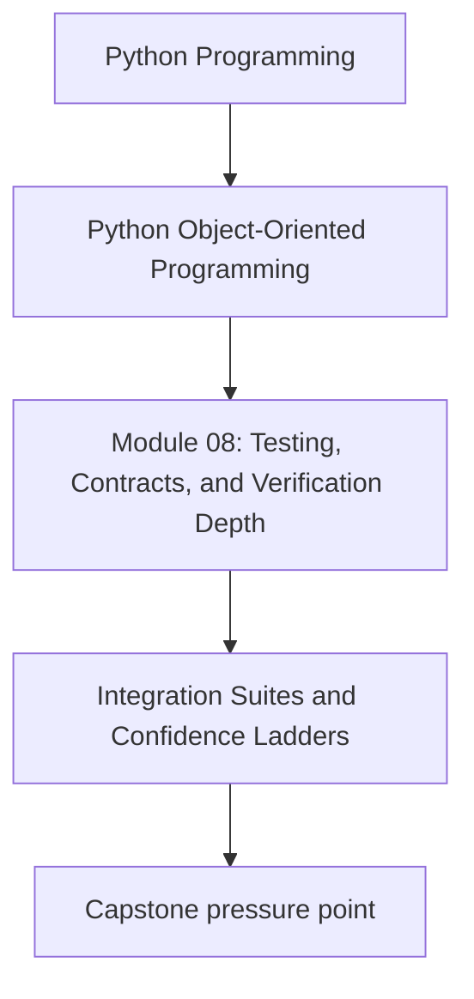
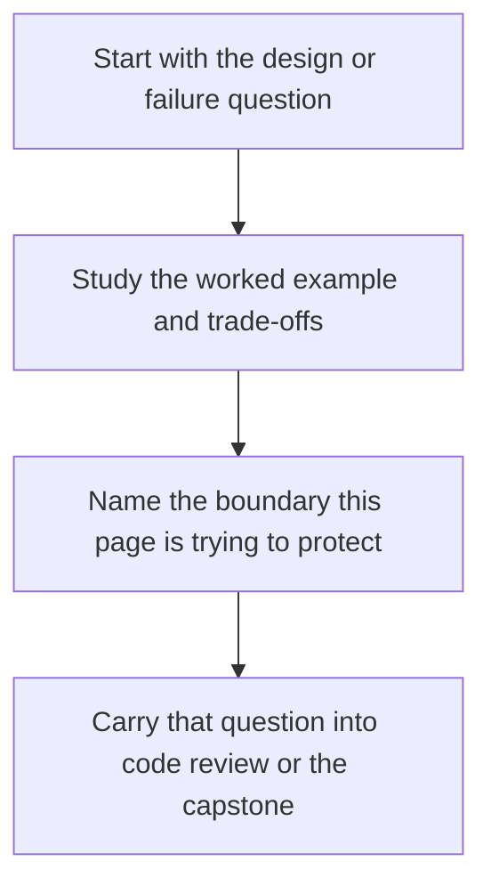

# Integration Suites and Confidence Ladders

<!-- page-maps:start -->
## Concept Position

<!-- page-maps:end -->

Read the first diagram as a placement map: this page is one concept inside its parent module, not a detached essay, and the capstone is the pressure test for whether the idea holds. Read the second diagram as the working rhythm for the page: name the problem, study the example, identify the boundary, then carry one review question forward.

## Purpose

Layer tests so each level answers a different risk question, creating justified
confidence instead of one oversized suite that is slow and vague.

## 1. Different Risks Need Different Test Scopes

Examples:

- unit tests for local domain behavior
- contract tests for repositories and adapters
- integration tests for cross-layer workflows
- end-to-end scenarios for public-facing confidence

Each level should earn its cost.

## 2. Confidence Comes from Coverage of Failure Modes

A small set of well-chosen integration tests often beats a huge number of overlapping
unit tests when the real risk is at layer boundaries.

## 3. Keep the Ladder Explainable

Team members should know:

- what each suite proves
- when it runs
- what kind of regression it is expected to catch

If that is fuzzy, the suite structure is not doing enough design work.

## 4. Faster Feedback Still Matters

Do not push every check into the slowest layer. Use the cheapest layer that can prove
the claim honestly, then escalate only when boundary interactions matter.

## Practical Guidelines

- Define the purpose of each test layer explicitly.
- Cover real boundary and workflow risks in higher-level suites.
- Keep most checks in the cheapest layer that proves the claim.
- Review slow suites for redundant or low-signal cases.

## Exercises for Mastery

1. Map your current tests into a confidence ladder.
2. Move one redundant high-level test downward or delete it.
3. Add one integration test for a workflow that unit tests do not truly cover.
