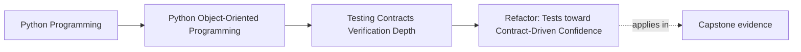
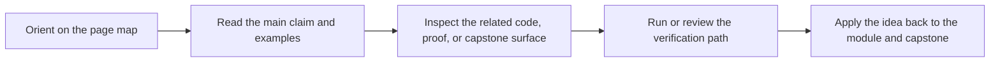

# Refactor: Tests toward Contract-Driven Confidence

<!-- page-maps:start -->
## Page Maps

<!-- page-maps:end -->

Read the first diagram as a placement map: this page is one concept inside its parent module, not a detached essay, and the capstone is the pressure test for whether the idea holds. Read the second diagram as the working rhythm for the page: name the problem, study the example, identify the boundary, then carry one review question forward.

## Goal

Rework the monitoring capstone test strategy so confidence comes from explicit object,
repository, runtime, and public-output contracts instead of one undifferentiated set of examples.

## Refactor Outline

1. Tighten behavior-first tests around aggregate commands and events.
2. Add lifecycle sequence tests for registration, activation, evaluation, and retirement.
3. Define shared repository and adapter contract suites.
4. Add at least one property-based check for round-trips or lifecycle invariants.
5. Review snapshots and end-to-end tests so they protect stable public outputs only.

## What to Watch For

- Tests should speak in domain language rather than implementation detail.
- Shared fixtures should not hide the setup needed to understand an invariant.
- Contract suites should be reusable across backend or adapter implementations.
- Higher-level suites should cover workflows that lower layers cannot honestly prove.

## Suggested Verification

- run the full test suite and identify which layer proves each major claim
- break one repository or adapter guarantee and confirm the shared contract suite catches it
- mutate one lifecycle rule and confirm sequence tests fail
- review whether any snapshot update changes a true public contract

## Review Questions

1. Which tests prove domain behavior, and which prove boundary behavior?
2. Where are mocks still encoding internal choreography rather than contracts?
3. Which invariant now has the strongest verification evidence?
4. Which suite would catch a regression in the public-facing runtime flow?
