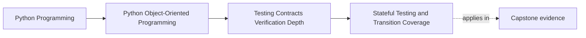
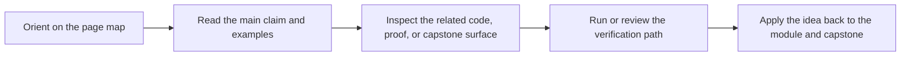

# Stateful Testing and Transition Coverage

<!-- page-maps:start -->
## Page Maps

<!-- page-maps:end -->

Read the first diagram as a placement map: this page is one concept inside its parent module, not a detached essay, and the capstone is the pressure test for whether the idea holds. Read the second diagram as the working rhythm for the page: name the problem, study the example, identify the boundary, then carry one review question forward.

## Purpose

Verify lifecycle-heavy objects by covering the paths between states, not only isolated
method calls.

## 1. Lifecycles Need Sequence-Based Tests

For aggregates and entities with typestate, correctness often depends on order:

- register before activate
- activate before evaluate
- retire before rejecting future changes

A single-call unit test cannot prove the whole lifecycle.

## 2. Enumerate Allowed and Forbidden Paths

Write down:

- legal transitions
- illegal transitions
- edge cases at boundaries such as duplicate activation or repeated retirement

That transition map becomes both design documentation and a test plan.

## 3. Watch for History-Dependent Bugs

Objects that appear correct after one command can fail after a sequence because cached
state, emitted events, or derived counters drift over time.

## 4. Property-Based Stateful Tests Can Help

When state machines grow, property-based testing can generate transition sequences and
check invariants after each step. Use it when hand-written cases stop covering the space.

## Practical Guidelines

- Test sequences of operations for lifecycle-heavy objects.
- Cover both allowed and forbidden transitions.
- Assert invariants after each meaningful state change.
- Introduce state-machine style testing when manual cases become repetitive or incomplete.

## Exercises for Mastery

1. Write down the legal lifecycle transitions for one aggregate.
2. Add tests for one duplicate or out-of-order command.
3. Choose one lifecycle that would benefit from state-machine style testing.
