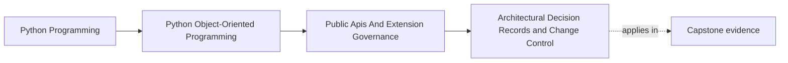
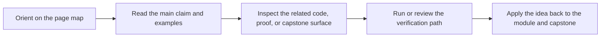

# Architectural Decision Records and Change Control

<!-- page-maps:start -->
## Page Maps

<!-- page-maps:end -->

## Purpose

Capture why public API and extension decisions were made so future changes are reviewed
against intent instead of personal memory.

## 1. Extension Surfaces Need Memory

Why is a plugin hook allowed here but not there?
Why does the facade expose this type but not that one?

If those reasons live only in chat threads or recollection, governance decays quickly.

## 2. Small Decision Records Beat Oral Tradition

An architectural decision record can capture:

- the decision
- alternatives considered
- why the chosen path won
- what future changes would revisit it

Keep it short, but keep it written.

## 3. Change Control Should Match Risk

Not every API change needs the same ceremony, but high-impact public or extension
changes should trigger deliberate review with compatibility questions attached.

## 4. Records Should Stay Connected to Code

Decision records matter only if reviewers can find them near the relevant code, docs,
or contribution workflow.

## Practical Guidelines

- Record high-impact public API and extension decisions in a short durable form.
- Review future changes against the recorded rationale.
- Match review ceremony to the compatibility risk of the change.
- Keep records close to the code or docs they govern.

## Exercises for Mastery

1. Write a short decision record for one extension point in your system.
2. Identify one public API change that should require explicit compatibility review.
3. Decide where decision records should live so maintainers will actually use them.
