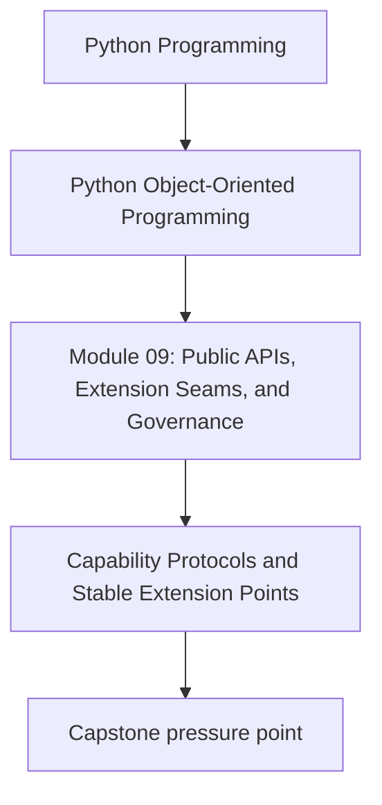
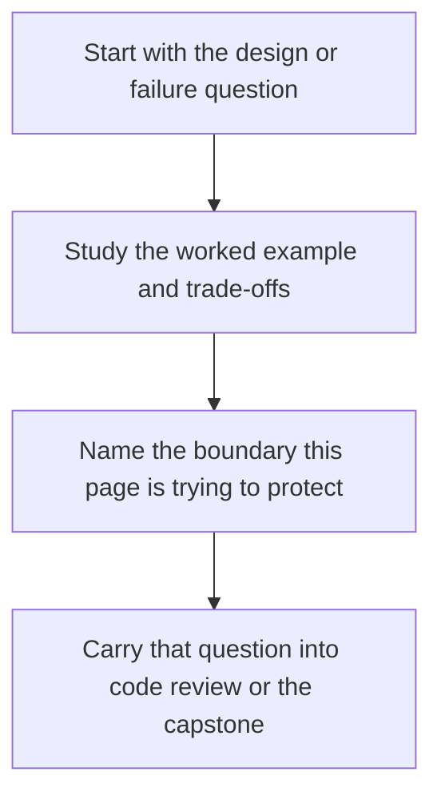

# Capability Protocols and Stable Extension Points

<!-- page-maps:start -->
## Concept Position

<!-- page-maps:end -->

Read the first diagram as a placement map: this page is one concept inside its parent module, not a detached essay, and the capstone is the pressure test for whether the idea holds. Read the second diagram as the working rhythm for the page: name the problem, study the example, identify the boundary, then carry one review question forward.

## Purpose

Design extension seams around the capabilities consumers need rather than around direct
access to internal classes and state.

## 1. Extensions Need Small, Honest Contracts

A plugin or custom adapter usually needs only a few capabilities:

- evaluate a rule
- fetch samples
- publish incidents

Expose those needs as small protocols or abstract interfaces.

## 2. Capability Beats Intimacy

If an extension must reach into aggregate internals, the seam is not ready. Stable
extension points should ask for inputs and return outputs, not mutate hidden state.

## 3. Version Capability Contracts Carefully

Adding a required method or widening argument semantics changes the extension contract.
Treat that as public API evolution, not a local refactor.

## 4. Composition Roots Choose Concrete Wiring

Extension authors should implement capabilities, while the composition root decides how
those implementations join the rest of the system.

## Practical Guidelines

- Expose small protocols for extension capabilities.
- Keep plugins and custom adapters outside aggregate internals.
- Treat capability changes as public API changes.
- Centralize extension wiring in the composition root.

## Exercises for Mastery

1. Define one capability protocol for a replaceable behavior in your system.
2. Remove one extension path that depends on private state access.
3. Review one protocol and identify what would count as a breaking change.
