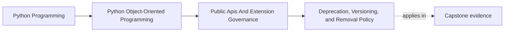
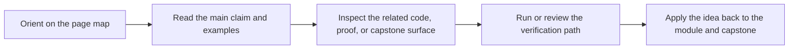

# Deprecation, Versioning, and Removal Policy

<!-- page-maps:start -->
## Page Maps

<!-- page-maps:end -->

## Purpose

Make API change predictable by treating deprecation and removal as explicit lifecycle
management for public behavior.

## 1. Public APIs Need Lifecycles Too

A public method or module can be:

- introduced
- deprecated
- supported for a stated window
- removed with a major or otherwise documented change

If you do not define that lifecycle, consumers infer one from habit.

## 2. Deprecation Needs More than a Warning

A useful deprecation includes:

- what is changing
- when it will be removed
- what to migrate to

Warnings without migration guidance create resentment, not clarity.

## 3. Behavioral Compatibility Matters Too

Changing return semantics, ordering guarantees, or error types can be just as breaking
as changing a function signature.

## 4. Removal Should Be Verified, Not Assumed

Before removing a deprecated surface, update examples, tests, compatibility suites, and
release notes so the change is coherent across the full public surface.

## Practical Guidelines

- Give public APIs explicit introduction, deprecation, and removal policy.
- Pair warnings with migration guidance and timing.
- Review behavioral changes for compatibility impact, not only signatures.
- Verify removal across docs, examples, and test suites.

## Exercises for Mastery

1. Write a deprecation notice for one public API you would like to replace.
2. Identify one behavioral change that should count as breaking in your system.
3. Create a removal checklist that includes docs and compatibility suites.
