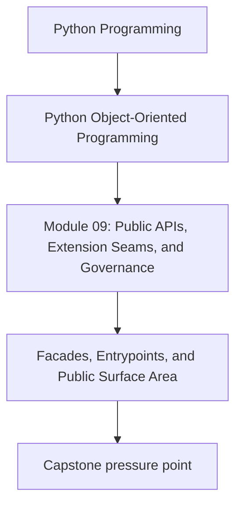
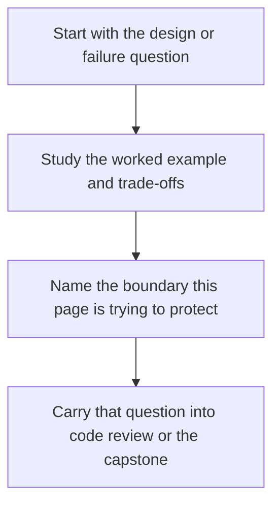

# Facades, Entrypoints, and Public Surface Area

<!-- page-maps:start -->
## Concept Position

<!-- page-maps:end -->

Read the first diagram as a placement map: this page is one concept inside its parent module, not a detached essay, and the capstone is the pressure test for whether the idea holds. Read the second diagram as the working rhythm for the page: name the problem, study the example, identify the boundary, then carry one review question forward.

## Purpose

Define where consumers should enter the system so internal modules do not become
accidental long-term contracts.

## 1. Public by Reachability Is a Trap

In Python, any importable module can look public if users can discover it. That does
not mean you should support all of it forever.

## 2. Facades Narrow the Promise

A facade or top-level package surface can expose:

- stable commands
- public types
- supported extension points

This gives consumers one place to depend on instead of spelunking through internals.

## 3. Entrypoints Should Match Real Use Cases

Do not export objects merely because they exist. Export the surfaces that represent the
main workflows consumers actually need.

## 4. Internal Structure Can Then Evolve

Once consumers rely on the facade, internal modules can change more freely. That is the
governance payoff of a narrow public surface.

## Practical Guidelines

- Define a stable public entry surface deliberately.
- Export user-facing workflows and types, not every internal class.
- Document which modules are public and which are internal.
- Use facades to protect internal refactoring freedom.

## Exercises for Mastery

1. List the public modules of one package in your system.
2. Add or sketch a facade that removes the need for deep imports.
3. Identify one internal helper that should stop being imported directly.
