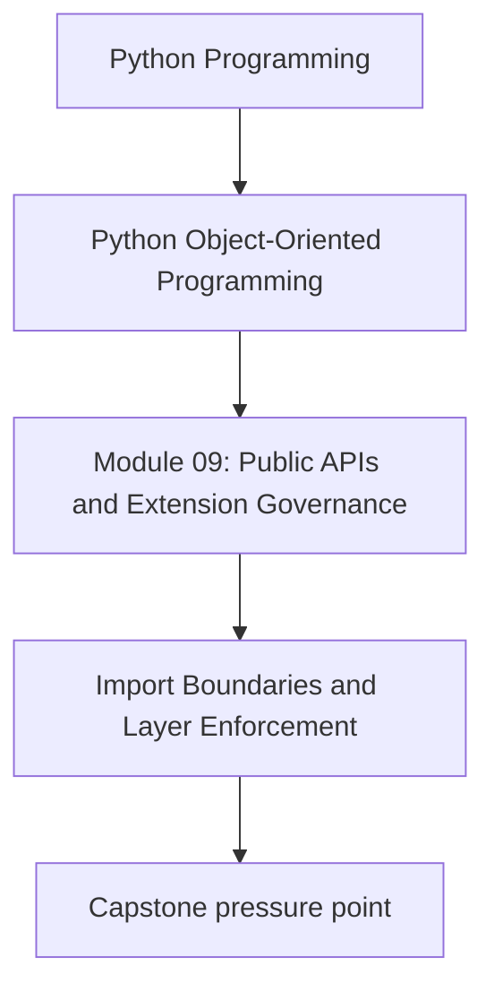
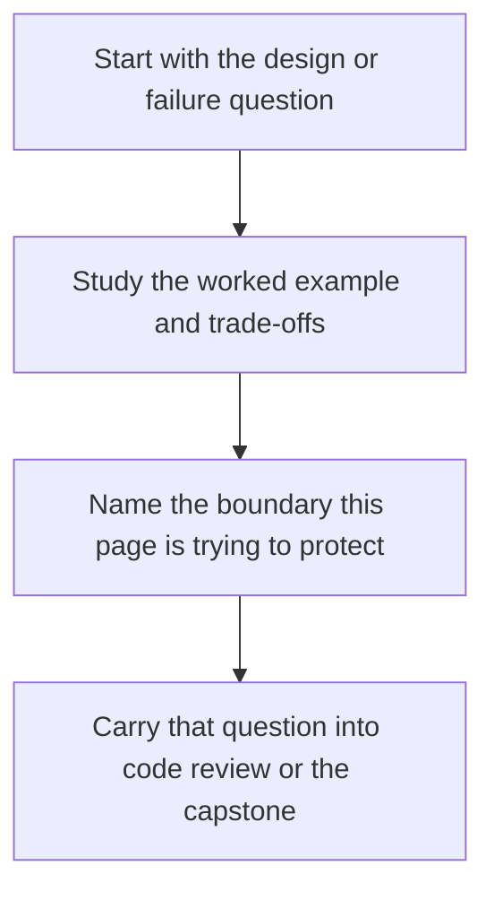

# Import Boundaries and Layer Enforcement

<!-- page-maps:start -->
## Concept Position

<!-- page-maps:end -->

Read the first diagram as a placement map: this page is one concept inside its parent module, not a detached essay, and the capstone is the pressure test for whether the idea holds. Read the second diagram as the working rhythm for the page: name the problem, study the example, identify the boundary, then carry one review question forward.

## Purpose

Prevent public consumers and internal layers from reaching across boundaries simply
because Python imports make it easy.

## 1. Import Freedom Needs Discipline

Python lets almost anything import almost anything. Without conventions, internal
helpers, adapters, and domain modules become a tangled graph.

## 2. Layer Rules Need Names

Examples:

- domain does not import infrastructure
- plugins do not import aggregate internals
- application entrypoints depend on public capability interfaces, not implementations

Named rules are easier to review than vague expectations.

## 3. Enforce with Structure and Tooling

Packages, facades, lint rules, and import-graph checks can all help. Tooling should
support the architecture instead of hoping reviewers catch every violation manually.

## 4. Exceptions Should Be Explicit

Sometimes a layer rule needs a narrow exception. Record it, justify it, and avoid
turning "temporary" into architectural amnesia.

## Practical Guidelines

- Define import and layer rules explicitly.
- Use package structure and tools to reinforce those rules.
- Review deep imports as potential architecture violations.
- Record justified exceptions instead of letting them spread silently.

## Exercises for Mastery

1. Draw one import rule your codebase should enforce.
2. Find one deep import that violates your intended layering.
3. Choose one tool or review check that could catch the violation earlier.
