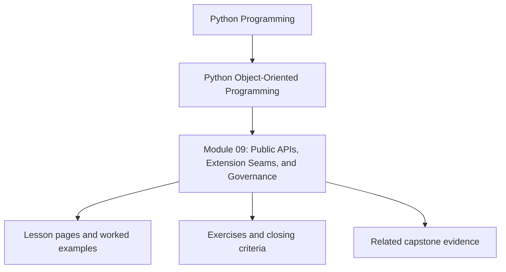
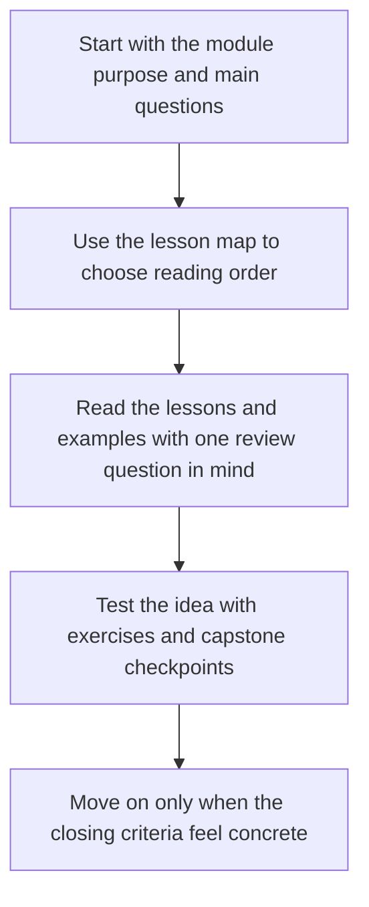

# Module 09: Public APIs, Extension Seams, and Governance

<!-- page-maps:start -->
## Module Position

<!-- page-maps:end -->

Read the first diagram as a placement map: this page sits between the course promise, the lesson pages listed below, and the capstone surfaces that pressure-test the module. Read the second diagram as the study route for this page, so the diagrams point you toward the `Lesson map`, `Exercises`, and `Closing criteria` instead of acting like decoration.

Long-lived Python systems need more than internal cleanliness. They need clear public
entrypoints, stable extension seams, and governance around what may change without
breaking consumers. This module treats extensibility as a disciplined contract.

Keep one question in view while reading:

> What is the narrowest surface that can be made public without letting consumers or plugins reach past the intended ownership boundary?

That question is what keeps extensibility from turning into unmanaged surface area.

## Preflight

- You should already be able to explain ownership boundaries before deciding what may become public or extensible.
- If facades, plugins, and compatibility guarantees still blur together, keep the capstone package boundary visible while reading.
- Treat every extension point as a governance cost, not as free optionality.

## Learning outcomes

- define the narrowest public surface that preserves object ownership and consumer clarity
- distinguish facades, capability-based seams, plugins, and internal modules by governance cost
- design deprecation, compatibility, and executable documentation policies that keep examples honest
- review extension mechanisms without letting consumers mutate internals directly

## Why this module matters

Without API discipline, object-oriented systems decay in familiar ways:

- internal modules become accidental public dependencies
- plugins reach past extension points into private state
- examples and docs drift away from executable reality
- deprecations are announced but not enforced

This module teaches how to create room for customization without turning the codebase
into an ungoverned surface area.

## Main questions

- What should count as the public API of a Python program or library?
- How do capability protocols and facades create safer extension points?
- When is plugin support worth the extra governance cost?
- How should versioning, deprecation, and compatibility suites be handled?
- Which review and architectural controls keep extension seams honest?

## Reading path

1. Start with facades, public surface area, and capability-based extension points.
2. Then study plugin design, deprecation policy, and executable documentation.
3. Finish with import discipline, review governance, and compatibility suites.
4. Use the refactor chapter to expose a clean capstone API without leaking internals.

## Public surface review route

1. Read `src/service_monitoring/application.py`.
2. Compare it with `capstone/PACKAGE_GUIDE.md` and `capstone/EXTENSION_GUIDE.md`.
3. Use `capstone/TARGET_GUIDE.md` and the learner-facing routes to decide which promises are public enough to defend.

This route keeps one governance question visible: a public surface is not simply the code
other people can import. It is the narrow surface you are prepared to document, version,
review, and prove repeatedly.

## Questions to settle before calling a seam public

- Would a consumer need this seam because of the domain contract, or only because the current file layout is convenient?
- Which extension belongs at the facade or capability boundary instead of deep internal imports?
- Which proof or walkthrough route would show another reviewer that this surface is intentionally supported?

## Common failure modes

- importing deep internal modules because they happen to be convenient today
- publishing extension hooks before lifecycle and ownership rules are clear
- letting examples rot because nobody treats them as executable promises
- claiming backward compatibility while removing behavior informally
- allowing plugins to mutate domain internals directly

## Exercises

- Name one surface that should become public and one surface that should stay private, then justify both in terms of ownership.
- Review one extension seam and explain which governance rule makes it safe enough to publish.
- Compare a facade-based extension point with direct internal imports and explain which consumer behavior each one encourages.

## Capstone connection

The monitoring capstone can remain a closed teaching example or evolve into a reusable
package surface. This module shows how to add a facade, documented extension points,
and governance around plugins and integrations without weakening aggregate boundaries.

## Honest completion signal

You are ready to move on when you can choose one capstone seam and explain:

- whether it should stay private or become public
- which governance rule makes that choice durable
- which evidence route would fail first if consumers started depending on the wrong layer

## Closing criteria

You should finish this module able to define and defend a public object-oriented Python
surface that supports customization, versioned change, and reviewable extension rules.
