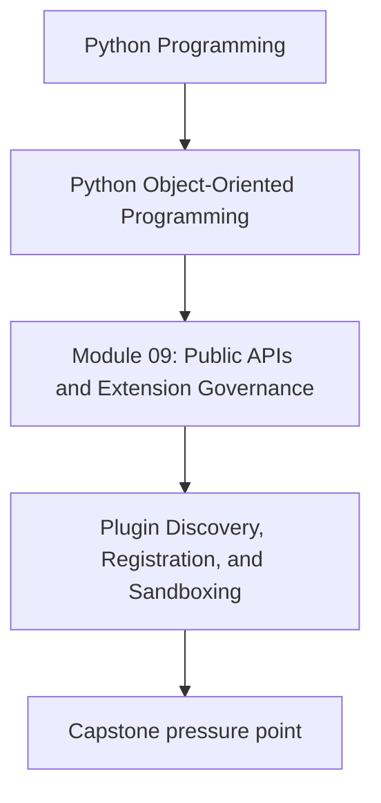
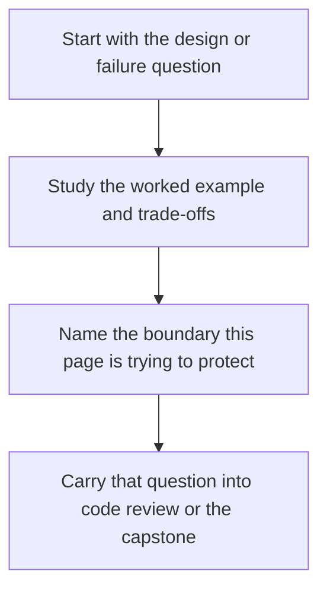

# Plugin Discovery, Registration, and Sandboxing

<!-- page-maps:start -->
## Concept Position

<!-- page-maps:end -->

Read the first diagram as a placement map: this page is one concept inside its parent module, not a detached essay, and the capstone is the pressure test for whether the idea holds. Read the second diagram as the working rhythm for the page: name the problem, study the example, identify the boundary, then carry one review question forward.

## Purpose

Support plugins only when the system can discover, validate, and constrain them with
clear lifecycle and safety rules.

## 1. Plugins Add Governance Cost

Plugin support is not "more extensible for free." It adds questions about:

- discovery
- registration order
- version compatibility
- failure isolation
- security and trust

If those questions are not worth answering, do not add plugins yet.

## 2. Registration Should Validate Capability and Metadata

A plugin loader should check:

- required interface or protocol support
- version compatibility
- unique names or identifiers
- declared configuration needs

Loose registration invites runtime surprises.

## 3. Discovery Mechanisms Need Intent

Possible approaches:

- explicit configuration
- package entry points
- module scanning inside a trusted namespace

Choose the simplest mechanism that matches the deployment model.

## 4. Sandboxing Is Usually a Process Boundary Problem

In-process plugins share memory and failure modes with the host. If untrusted code is
involved, real isolation usually requires a stronger boundary than a Python interface.

## Practical Guidelines

- Add plugin support only when you can justify its governance cost.
- Validate plugin metadata and capability before registration.
- Prefer explicit discovery over magical scanning when clarity matters.
- Do not confuse in-process plugins with real sandboxing.

## Exercises for Mastery

1. Decide whether one customization need in your system truly requires plugins.
2. Define the metadata a plugin should declare before registration.
3. Document which plugins are trusted in-process and which would require stronger isolation.
