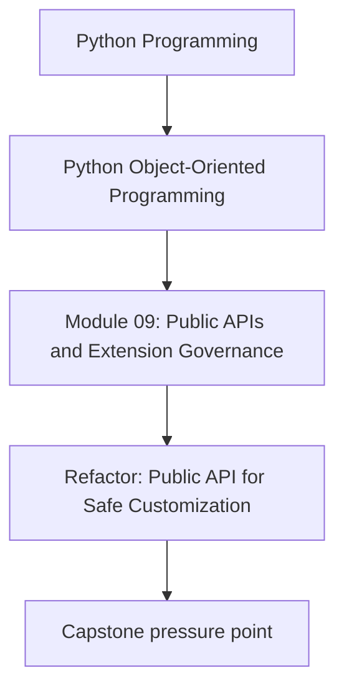
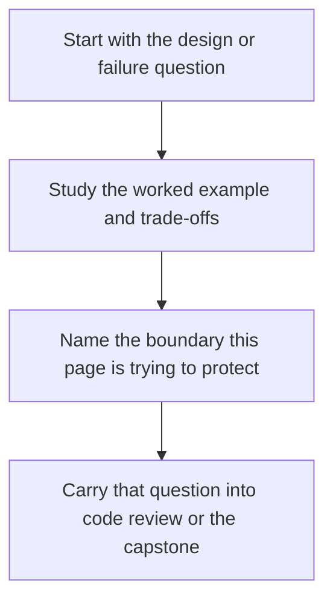

# Refactor: Public API for Safe Customization

<!-- page-maps:start -->
## Concept Position

<!-- page-maps:end -->

Read the first diagram as a placement map: this page is one concept inside its parent module, not a detached essay, and the capstone is the pressure test for whether the idea holds. Read the second diagram as the working rhythm for the page: name the problem, study the example, identify the boundary, then carry one review question forward.

## Goal

Expose the monitoring capstone through a clean public surface with documented extension
points, compatibility policy, and reviewable customization rules.

## Refactor Outline

1. Define a facade for supported commands, public types, and extension capabilities.
2. Separate internal modules from the public entry surface.
3. Add a protocol or interface for one supported customization point.
4. Document deprecation and compatibility expectations for that surface.
5. Add executable examples and compatibility checks around the supported path.

## What to Watch For

- Consumers should not need deep imports into internal capstone modules.
- Extension points should not mutate aggregate internals directly.
- Docs and examples should demonstrate the supported public path.
- Review notes should explain why each exported surface is public.

## Suggested Verification

- run an example using only the new facade surface
- fail a compatibility test by changing an exported behavior
- register a custom implementation through the supported extension point
- review imports to confirm internal modules are no longer the expected public path

## Review Questions

1. Which surfaces are now explicitly public, and why?
2. What customization is supported without private-state access?
3. How would a deprecation on the facade be communicated and verified?
4. Which tests prove that examples and compatibility promises stay current?
