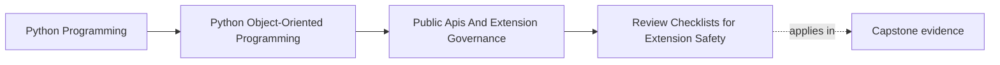
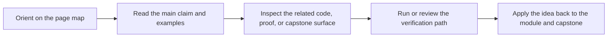

# Review Checklists for Extension Safety

<!-- page-maps:start -->
## Page Maps

<!-- page-maps:end -->

## Purpose

Give reviewers a repeatable way to evaluate API and plugin changes before accidental
surface area or unsafe extension patterns become permanent.

## 1. Checklists Reduce Blind Spots

Useful review questions include:

- is this surface truly public
- who will depend on it
- what invariants remain protected
- how would we deprecate it later
- what tests and docs prove the contract

## 2. Review Should Cover Behavior, Not Only Types

A plugin hook may look small in code while still exposing timing, ordering, or
thread-safety assumptions that become public obligations.

## 3. Safety Includes Failure Semantics

Ask what happens when an extension:

- raises an error
- blocks too long
- returns malformed data
- is missing at startup

Extension safety is incomplete without these cases.

## 4. Make the Checklist Reusable

The goal is not bureaucracy. The goal is to keep high-impact reviews consistent across
different maintainers and future iterations.

## Practical Guidelines

- Review extension surfaces with a standard set of compatibility and safety questions.
- Include failure semantics and lifecycle concerns in the checklist.
- Tie checklist items to docs and tests where possible.
- Keep the checklist short enough to be used consistently.

## Exercises for Mastery

1. Draft a six-question review checklist for a new plugin hook.
2. Use it on one existing extension surface and note the gaps.
3. Add one missing failure-path test discovered by the checklist.
