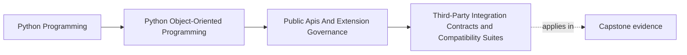

# Third-Party Integration Contracts and Compatibility Suites

<!-- page-maps:start -->
## Page Maps

<!-- page-maps:end -->

## Purpose

Protect integrations with external consumers or providers by testing the compatibility
contract explicitly instead of trusting ad hoc manual checks.

## 1. External Boundaries Drift Faster than You Think

Third-party services, plugins, and consuming applications can all change independently.
Compatibility suites make that drift visible before release.

## 2. Test the Contract You Promise

Examples:

- accepted request and response shapes
- timeout and retry behavior
- ordering guarantees
- version markers and deprecation windows

This is broader than one happy-path integration test.

## 3. Include Representative Consumer Scenarios

If a public API is mainly used through one documented extension path or one external
workflow, keep that scenario in the compatibility suite.

## 4. Update the Suite When the Contract Changes

Compatibility tests are only valuable when they evolve with the supported surface.
Old tests that no longer match the real promise become misleading.

## Practical Guidelines

- Define compatibility suites for important third-party boundaries.
- Cover shape, behavior, timing, and failure expectations.
- Include representative consumer workflows, not only isolated calls.
- Review and update the suite whenever the supported contract changes.

## Exercises for Mastery

1. Identify the most important external contract in your system.
2. Add one compatibility test for a non-happy-path behavior.
3. Review whether one existing integration test matches a real supported promise.
