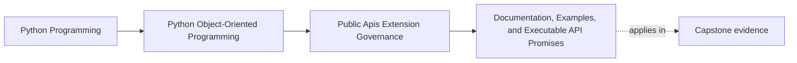
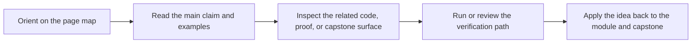

# Documentation, Examples, and Executable API Promises

<!-- page-maps:start -->
## Page Maps

<!-- page-maps:end -->

Read the first diagram as a placement map: this page is one concept inside its parent module, not a detached essay, and the capstone is the pressure test for whether the idea holds. Read the second diagram as the working rhythm for the page: name the problem, study the example, identify the boundary, then carry one review question forward.

## Purpose

Keep examples and reference material aligned with the real public API by treating them
as executable promises rather than marketing text.

## 1. Examples Teach the Intended Surface

Consumers often copy the first example they see. If that example imports internal
modules, bypasses invariants, or omits error handling, you have published the wrong API.

## 2. Make Documentation Reviewable

A reviewable API guide shows:

- the supported entrypoint
- expected inputs and outputs
- important failure cases
- extension guidance when applicable

That is part of product design, not optional prose.

## 3. Execute What You Can

Where practical, run doctests, sample commands, or documentation-backed smoke tests so
examples fail when the public surface drifts.

## 4. Keep Reference and Tutorial Roles Distinct

Tutorials guide first use.
Reference docs define stable detail.

Mixing them carelessly makes both harder to maintain.

## Practical Guidelines

- Show the supported public path in every example.
- Test or smoke-check important examples when practical.
- Document failure cases and migration guidance, not only happy paths.
- Separate tutorial flow from reference guarantees.

## Exercises for Mastery

1. Review one example and remove any deep internal imports.
2. Add an executable check for one public usage example.
3. Split one document that is mixing tutorial and reference roles.
