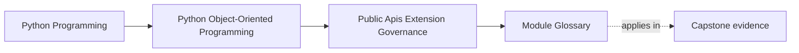
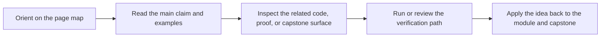

# Module Glossary

<!-- page-maps:start -->
## Page Maps

<!-- page-maps:end -->

This glossary belongs to **Module 09: Public APIs, Extension Seams, and Governance** in **Python Object-Oriented Programming**. It keeps the language of this directory stable so the same ideas keep the same names across reading, practice, review, and capstone proof.

## How to use this glossary

Read the directory index first, then return here whenever a page, command, or review discussion starts to feel more vague than the course intends. The goal is stable language, not extra theory.

## Terms in this directory

| Term | Meaning in this directory |
| --- | --- |
| Architectural Decision Records and Change Control | the module's treatment of architectural decision records and change control, used to make the module's main design claim concrete in design work, refactoring, and capstone evidence. |
| Capability Protocols and Stable Extension Points | the module's treatment of capability protocols and stable extension points, used to make the module's main design claim concrete in design work, refactoring, and capstone evidence. |
| Deprecation, Versioning, and Removal Policy | the module's treatment of deprecation, versioning, and removal policy, used to make the module's main design claim concrete in design work, refactoring, and capstone evidence. |
| Documentation, Examples, and Executable API Promises | the module's treatment of documentation, examples, and executable api promises, used to make the module's main design claim concrete in design work, refactoring, and capstone evidence. |
| Facades, Entrypoints, and Public Surface Area | the module's treatment of facades, entrypoints, and public surface area, used to make the module's main design claim concrete in design work, refactoring, and capstone evidence. |
| Import Boundaries and Layer Enforcement | the module's treatment of import boundaries and layer enforcement, used to make the module's main design claim concrete in design work, refactoring, and capstone evidence. |
| Plugin Discovery, Registration, and Sandboxing | the module's treatment of plugin discovery, registration, and sandboxing, used to make the module's main design claim concrete in design work, refactoring, and capstone evidence. |
| Refactor: Public API for Safe Customization | the module's treatment of refactor: public api for safe customization, used to make the module's main design claim concrete in design work, refactoring, and capstone evidence. |
| Review Checklists for Extension Safety | the review surface that pressure-tests the module after the first read so you can check judgment, not just recall. |
| Third-Party Integration Contracts and Compatibility Suites | the module's treatment of third-party integration contracts and compatibility suites, used to make the module's main design claim concrete in design work, refactoring, and capstone evidence. |
