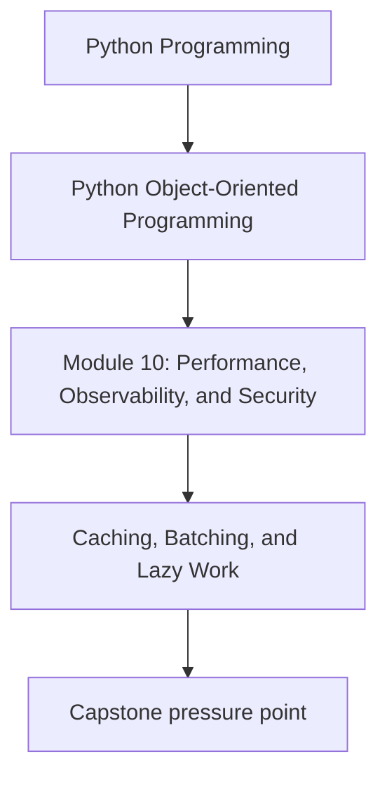
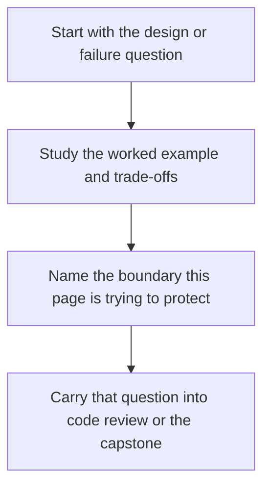

# Caching, Batching, and Lazy Work

<!-- page-maps:start -->
## Concept Position

<!-- page-maps:end -->

Read the first diagram as a placement map: this page is one concept inside its parent module, not a detached essay, and the capstone is the pressure test for whether the idea holds. Read the second diagram as the working rhythm for the page: name the problem, study the example, identify the boundary, then carry one review question forward.

## Purpose

Improve performance with techniques that reduce redundant work while keeping ownership,
freshness, and failure semantics explicit.

## 1. Every Speedup Technique Changes Behavior

Caching changes freshness.
Batching changes timing and failure grouping.
Lazy work changes when cost is paid.

Treat those as semantic trade-offs, not invisible implementation details.

## 2. Batch at Honest Boundaries

If multiple repository loads or metric fetches can be grouped, batching may reduce
overhead. But the batch boundary should still respect ownership and error reporting.

## 3. Lazy Work Needs Visibility

Deferred computation can improve latency or startup time, but hidden laziness makes
debugging harder when the first read unexpectedly triggers heavy work.

## 4. Prefer Narrow, Measured Changes

Add one cache or batch point with a clear owner and invalidation rule before building a
generic performance framework that nobody can explain.

## Practical Guidelines

- Document freshness, timing, and ownership changes introduced by performance techniques.
- Batch at repository or adapter boundaries when it reduces real overhead.
- Make lazy work visible to callers when it is expensive or failure-prone.
- Prefer narrow optimizations with measured benefit.

## Exercises for Mastery

1. Choose one repeated boundary call that may benefit from batching.
2. Define the freshness contract for one cache you would add.
3. Identify one lazy computation that should become explicit in the API.
