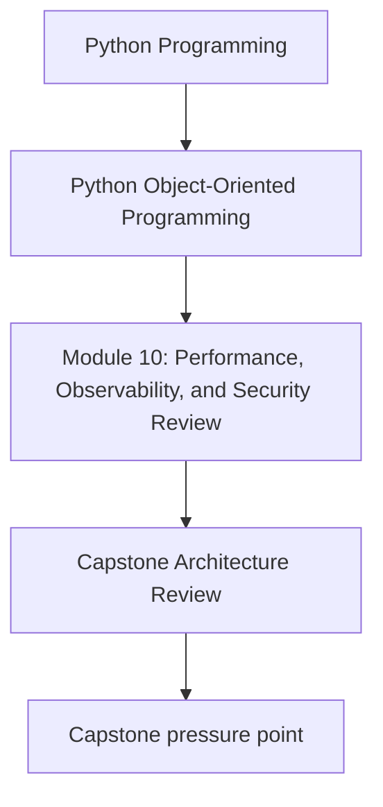
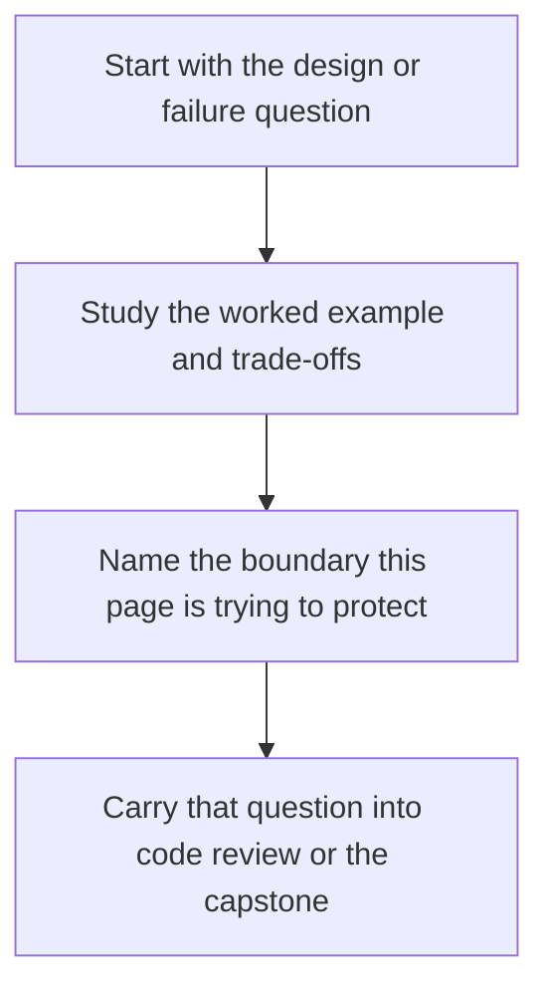

# Capstone Architecture Review

<!-- page-maps:start -->
## Concept Position

<!-- page-maps:end -->

Read the first diagram as a placement map: this page is one concept inside its parent module, not a detached essay, and the capstone is the pressure test for whether the idea holds. Read the second diagram as the working rhythm for the page: name the problem, study the example, identify the boundary, then carry one review question forward.

## Purpose

Review the monitoring capstone as a whole system and evaluate whether its object model,
boundaries, and operational surfaces still hold under advanced scrutiny.

## 1. Revisit the Original Promises

The capstone promised:

- explicit value and entity semantics
- aggregate-owned invariants
- policy-based variation
- downstream projections
- explicit unit-of-work boundaries

Review each promise against the code as it stands now.

## 2. Ask the Operational Questions Too

Beyond model purity, check:

- where performance would matter first
- which events and commands deserve observability
- where serialization crosses trust boundaries
- how extension points would be governed

## 3. Find the Tension Points

Strong design review looks for pressure, not only beauty. Which boundary would bend
first under more throughput, another storage backend, or a new plugin model?

## 4. Record the Review Outcome

An architecture review is useful only if it yields:

- strengths worth preserving
- risks worth addressing
- explicit next improvements

## Practical Guidelines

- Review the capstone against both design and operational criteria.
- Tie concerns back to concrete boundaries and object roles.
- Record strengths, risks, and improvement priorities explicitly.
- Use the review to guide hardening work, not only to admire the model.

## Exercises for Mastery

1. Write a short architecture review for the capstone or your own system.
2. Identify the boundary most likely to feel pressure first under growth.
3. List two strengths you would preserve during future refactoring.
