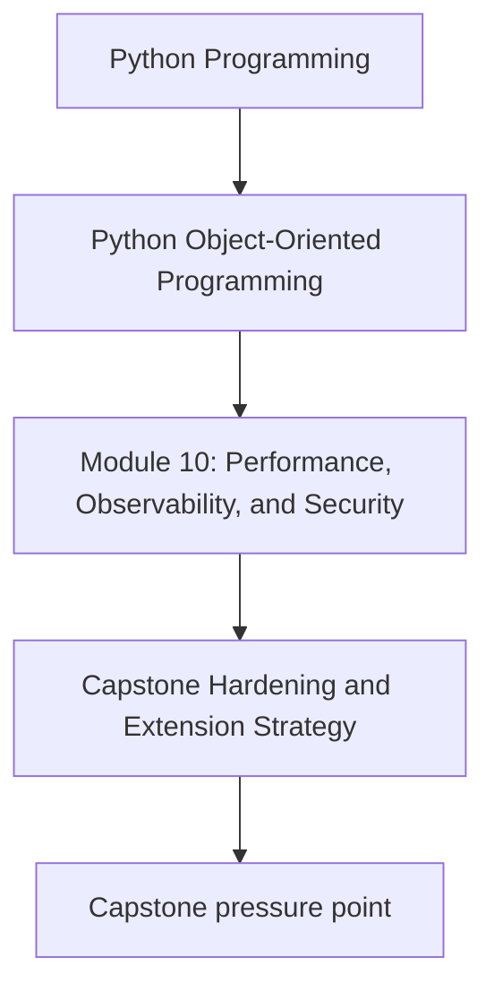
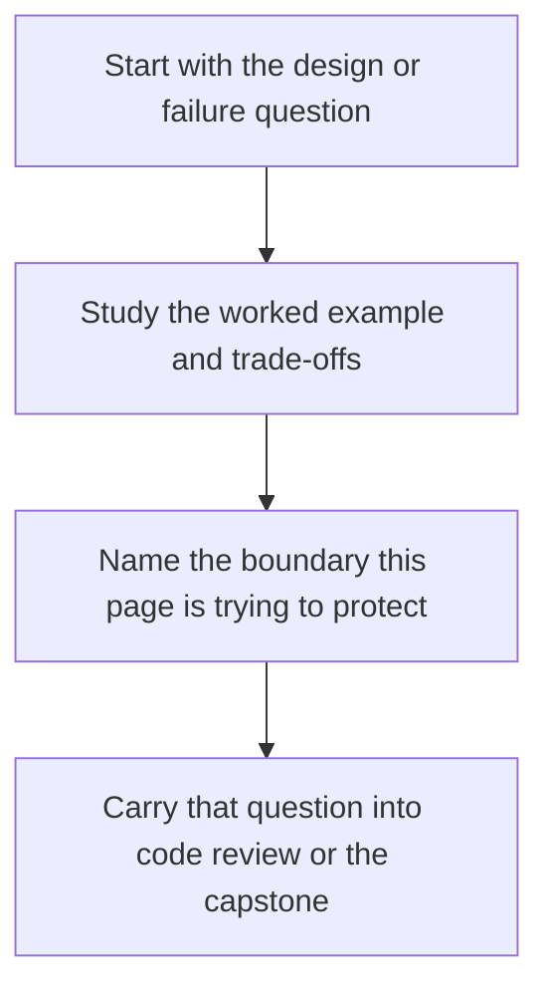

# Capstone Hardening and Extension Strategy

<!-- page-maps:start -->
## Concept Position

<!-- page-maps:end -->

Read the first diagram as a placement map: this page is one concept inside its parent module, not a detached essay, and the capstone is the pressure test for whether the idea holds. Read the second diagram as the working rhythm for the page: name the problem, study the example, identify the boundary, then carry one review question forward.

## Purpose

Plan the next round of capstone evolution so new performance, security, and extension
work strengthens the design instead of bypassing it.

## 1. Hardening Should Follow the Existing Shape

Examples of coherent improvements:

- add repository contracts before new storage backends
- add explicit observability around runtime boundaries
- add capability-based extensions before plugin discovery
- add safer codecs before widening serialized surfaces

Each improvement respects an existing ownership boundary.

## 2. Sequence Improvements by Risk

Do not start with speculative optimization if trust-boundary bugs or missing runbooks
would hurt more in real operation.

## 3. Preserve the Teaching Value

The capstone should stay small enough to explain. Hardening work should clarify design
pressure, not bury it under framework volume.

## 4. Convert Plans into Reviewable Increments

A good extension strategy becomes a sequence of small, testable changes with explicit
compatibility and verification notes.

## Practical Guidelines

- Extend the capstone along existing design boundaries.
- Prioritize operational and trust-boundary risk before speculative polish.
- Keep improvements small enough to review and teach clearly.
- Pair each extension with verification and compatibility expectations.

## Exercises for Mastery

1. Prioritize three capstone improvements in risk order.
2. Explain why each improvement belongs to its chosen boundary.
3. Define the verification evidence you would require before merging the first one.
