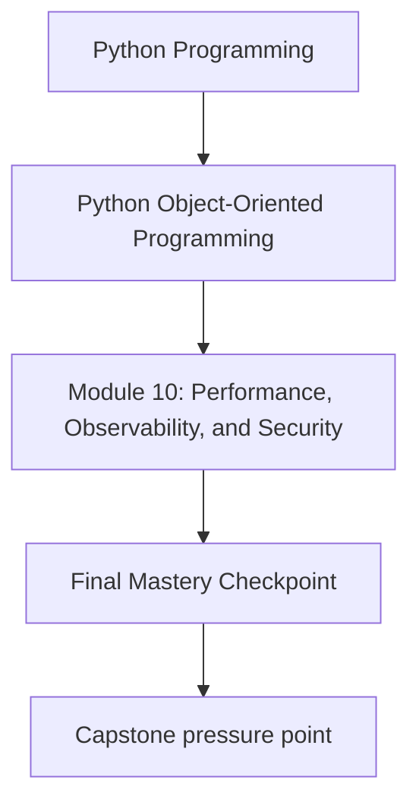
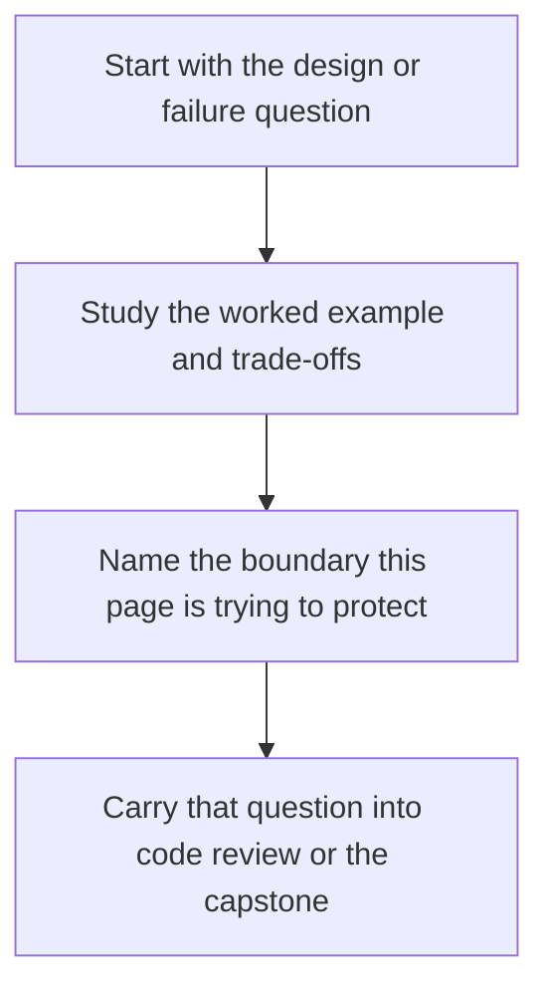

# Final Mastery Checkpoint

<!-- page-maps:start -->
## Concept Position

<!-- page-maps:end -->

Read the first diagram as a placement map: this page is one concept inside its parent module, not a detached essay, and the capstone is the pressure test for whether the idea holds. Read the second diagram as the working rhythm for the page: name the problem, study the example, identify the boundary, then carry one review question forward.

## Goal

Use the full ten-module roadmap to judge whether you can design, evolve, verify, and
operate an object-oriented Python system with deliberate boundaries.

## Mastery Questions

1. Can you explain the semantic contract of your important objects without appealing to folklore?
2. Can you place behavior in values, entities, policies, repositories, and adapters with clear reasons?
3. Can you make invalid state, stale writes, unsafe retries, and unsupported extensions visible?
4. Can you evolve storage, APIs, and serialized formats with compatibility discipline?
5. Can you design tests, observability, and runbooks that match the real failure modes of the system?

## Capstone Synthesis

The monitoring capstone now serves as a review lens for the full course:

- Modules 01 to 03 justify object semantics, role boundaries, and lifecycle design.
- Modules 04 to 06 justify aggregates, repositories, serialization, and schema evolution.
- Modules 07 to 10 justify runtime coordination, verification, extension governance, and operational hardening.

If you can read the capstone and explain those layers without hand-waving, the course has done its job.

## Suggested Final Review

- trace one change from public API through application orchestration into the aggregate
- explain how that change would be persisted, verified, observed, and secured
- identify the compatibility and operational risks before implementation
- propose the smallest reviewable change set that would deliver it safely

## Outcome

You should be ready to review or build object-oriented Python systems with stronger
judgment about semantics, boundaries, evolution, and operational reality than a
pattern catalog or syntax tutorial can provide.
