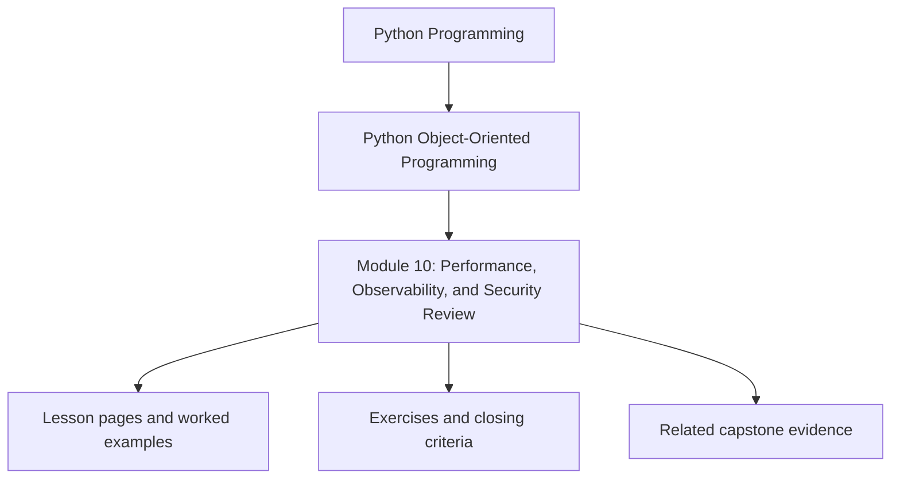
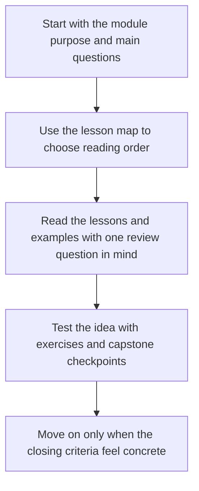

# Module 10: Performance, Observability, and Security Review Review

<!-- page-maps:start -->
## Module Position

<!-- page-maps:end -->

Read the first diagram as a placement map: this page sits between the course promise, the lesson pages listed below, and the capstone surfaces that pressure-test the module. Read the second diagram as the study route for this page, so the diagrams point you toward the `Lesson map`, `Exercises`, and `Closing criteria` instead of acting like decoration.

This final module brings object-oriented Python design into operational reality. It
teaches how to measure object cost, add observability that clarifies behavior, harden
trust boundaries, and review the full capstone with production-grade judgment.

Keep one question in view while reading:

> Which operational pressure can change the shape of the design safely, and which one would quietly corrupt the ownership model if handled carelessly?

That question is what turns operational hardening into the final design audit instead of
an unrelated production checklist.

## Preflight

- You should already be able to explain the semantic ownership model before tuning or hardening the system.
- If performance, observability, or security work still feels like a collection of isolated checklists, tie each concern back to the object model while reading.
- Keep asking which operational change preserves the design and which one silently corrupts it.

## Learning outcomes

- measure and improve performance without changing the object contract accidentally
- add logs, metrics, traces, and runbooks that clarify object collaboration rather than obscuring it
- evaluate trust boundaries, deserialization, and secret handling as design constraints
- perform a full-system production review without abandoning the ownership model established earlier in the course

## Why this module matters

Well-structured code can still fail in production if it:

- allocates excessively on hot paths
- hides failures behind weak logs and missing signals
- deserializes untrusted input carelessly
- exposes secrets or internal details through convenience shortcuts

Mastery includes knowing how to improve those concerns without wrecking the model that
made the system understandable in the first place.

## Main questions

- How do you measure object and allocation cost before changing design?
- Which performance techniques preserve semantics, and which quietly change behavior?
- What logs, metrics, and traces make object collaboration observable?
- How should trust boundaries, secrets, and input hardening shape Python APIs?
- How do you review a full object-oriented system for operational readiness?

## Reading path

1. Start with measurement, profiling, caching, and batching.
2. Then study observability and security boundaries together as operational contracts.
3. Finish with runbooks, capstone review, and the final mastery checkpoint.
4. Treat the closing chapters as a full-system audit, not just another feature pass.

## Operational audit route

1. Start with `capstone/INSPECTION_GUIDE.md` and `capstone/TARGET_GUIDE.md`.
2. Compare those learner-facing routes with `capstone/PROOF_GUIDE.md`.
3. Only then inspect the implementation surfaces that make the operational claim plausible.

This route keeps the final module honest: operational hardening should improve confidence,
observability, and trust boundaries without forcing the reader to abandon the ownership
model built earlier in the course.

## Audit questions to keep explicit

- Which performance change preserves semantics, and which one silently changes freshness, ordering, or authority?
- Which signal should clarify collaboration rather than merely increase log volume?
- Which trust boundary needs a stronger review artifact, command route, or runbook before the change is safe?

## Common failure modes

- optimizing by folklore before measuring real hot paths
- adding caches that change correctness or freshness semantics silently
- logging sensitive payloads because it is convenient during debugging
- treating deserialization as harmless data loading instead of a trust boundary
- shipping a system with no runbook for the failure modes the design already predicts

## Exercises

- Pick one suspected hot path and explain what you would measure before changing the design.
- Review one observability addition and state what behavior it should clarify without leaking sensitive or misleading data.
- Describe one trust boundary in the capstone and explain which review artifact or runbook should accompany it.

## Capstone connection

The monitoring capstone is intentionally small, but it still exposes the same questions
as a larger system: where performance matters, which signals operators need, how payloads
cross trust boundaries, and what it means to evolve the design without losing clarity.

## Honest completion signal

You are ready to finish the course when you can review one operational change and say:

- what semantic contract must not change
- which review artifact or proof route should reveal drift first
- which hardening move belongs at the boundary instead of inside the domain model

## Closing criteria

You should finish this module able to review and harden an object-oriented Python system
for production use while preserving the semantic discipline built through the earlier modules.
