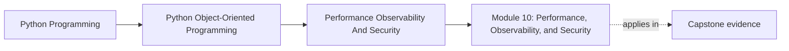

# Module 10: Performance, Observability, and Security

<!-- page-maps:start -->
## Page Maps

<!-- page-maps:end -->

This final module brings object-oriented Python design into operational reality. It
teaches how to measure object cost, add observability that clarifies behavior, harden
trust boundaries, and review the full capstone with production-grade judgment.

Keep one question in view while reading:

> Which operational pressure can change the shape of the design safely, and which one would quietly corrupt the ownership model if handled carelessly?

That question is what turns operational hardening into the final design audit instead of
an unrelated production checklist.

## Why this module matters

Well-structured code can still fail in production if it:

- allocates excessively on hot paths
- hides failures behind weak logs and missing signals
- deserializes untrusted input carelessly
- exposes secrets or internal details through convenience shortcuts

Mastery includes knowing how to improve those concerns without wrecking the model that
made the system understandable in the first place.

## Main questions

- How do you measure object and allocation cost before changing design?
- Which performance techniques preserve semantics, and which quietly change behavior?
- What logs, metrics, and traces make object collaboration observable?
- How should trust boundaries, secrets, and input hardening shape Python APIs?
- How do you review a full object-oriented system for operational readiness?

## Reading path

1. Start with measurement, profiling, caching, and batching.
2. Then study observability and security boundaries together as operational contracts.
3. Finish with runbooks, capstone review, and the final mastery checkpoint.
4. Treat the closing chapters as a full-system audit, not just another feature pass.

## Common failure modes

- optimizing by folklore before measuring real hot paths
- adding caches that change correctness or freshness semantics silently
- logging sensitive payloads because it is convenient during debugging
- treating deserialization as harmless data loading instead of a trust boundary
- shipping a system with no runbook for the failure modes the design already predicts

## Capstone connection

The monitoring capstone is intentionally small, but it still exposes the same questions
as a larger system: where performance matters, which signals operators need, how payloads
cross trust boundaries, and what it means to evolve the design without losing clarity.

## Outcome

You should finish this module able to review and harden an object-oriented Python system
for production use while preserving the semantic discipline built through the earlier modules.
