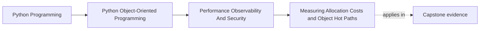
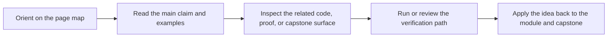

# Measuring Allocation Costs and Object Hot Paths

<!-- page-maps:start -->
## Page Maps

<!-- page-maps:end -->

## Purpose

Measure where object creation and data movement are expensive before trying to optimize
the design.

## 1. Cost Starts with Hot Paths

Most objects in a system are not performance problems. Focus on the places that execute
often, hold large collections, or sit inside latency-sensitive loops.

## 2. Allocation Is a Real Design Signal

Repeated construction of short-lived wrappers, copies, or intermediate records can be
the right trade-off for clarity, but you should know when that cost becomes material.

## 3. Measure with Representative Workloads

A microbenchmark of one helper function tells you little if production cost comes from a
workflow involving repositories, codecs, and projections together.

## 4. Preserve Meaning While Measuring

Performance work is easier to review when you can say:

- which path is hot
- what cost was measured
- which semantic behavior must not change

## Practical Guidelines

- Identify hot paths before optimizing object structure.
- Measure allocation and copy cost under representative workloads.
- Distinguish local micro-cost from full workflow cost.
- State the semantic behavior that optimization must preserve.

## Exercises for Mastery

1. Identify one hot path in your system and describe why it is hot.
2. Measure one allocation-heavy workflow before making any changes.
3. Review one object copy or wrapper and decide whether its cost is material or acceptable.
