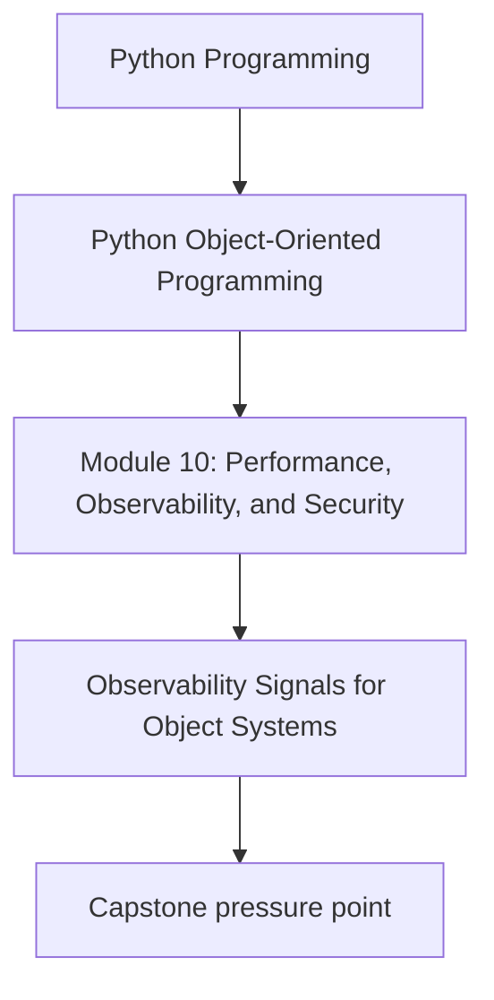
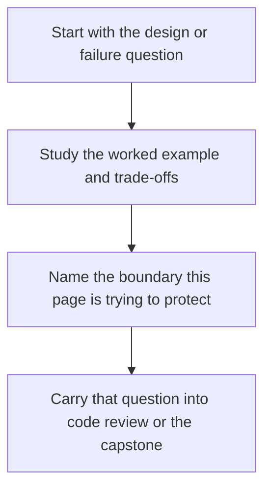

# Observability Signals for Object Systems

<!-- page-maps:start -->
## Concept Position

<!-- page-maps:end -->

Read the first diagram as a placement map: this page is one concept inside its parent module, not a detached essay, and the capstone is the pressure test for whether the idea holds. Read the second diagram as the working rhythm for the page: name the problem, study the example, identify the boundary, then carry one review question forward.

## Purpose

Add logs, metrics, and traces that explain how objects collaborate under load and failure
without turning observability into noisy decoration.

## 1. Observability Should Follow Design Boundaries

Useful signals often align with:

- application commands
- aggregate transitions
- repository saves and conflicts
- adapter retries and failures

That makes logs and metrics easier to map back to the architecture.

## 2. Use the Right Signal for the Question

- logs explain local events and context
- metrics summarize rates, counts, and durations
- traces connect one workflow across boundaries

Not every detail belongs in every signal type.

## 3. Correlation Matters

Identifiers such as policy ID, incident ID, or request ID help operators connect logs,
metrics, and traces to one coherent story.

## 4. Noise Is an Operational Bug

If important errors disappear inside debug spam or every retry logs as an incident,
observability is making the system harder to run.

## Practical Guidelines

- Emit signals at meaningful design boundaries.
- Match logs, metrics, and traces to the questions they answer best.
- Include correlation identifiers where workflows cross boundaries.
- Review signal volume and severity for operator usefulness, not only developer convenience.

## Exercises for Mastery

1. Define one metric and one structured log for an important workflow in your system.
2. Add a correlation identifier to one cross-layer path.
3. Remove or downgrade one noisy signal that obscures more important behavior.
