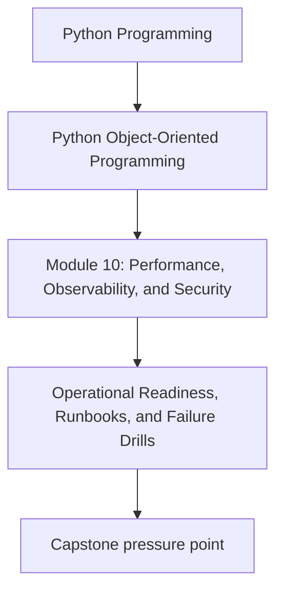
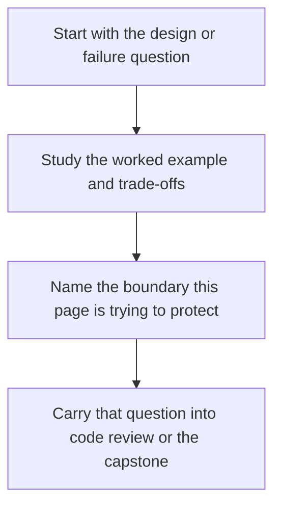

# Operational Readiness, Runbooks, and Failure Drills

<!-- page-maps:start -->
## Concept Position

<!-- page-maps:end -->

Read the first diagram as a placement map: this page is one concept inside its parent module, not a detached essay, and the capstone is the pressure test for whether the idea holds. Read the second diagram as the working rhythm for the page: name the problem, study the example, identify the boundary, then carry one review question forward.

## Purpose

Prepare object-oriented systems for real incidents by documenting failure handling and
practicing the operational paths the design implies.

## 1. Design Quality Includes Operability

If the system can emit conflicts, retry failures, stale caches, or plugin registration
errors, operators need a way to recognize and respond to those situations.

## 2. Runbooks Should Follow the Architecture

A useful runbook points to:

- the affected boundary
- likely failure signals
- safe first actions
- rollback or recovery steps

This is much easier when the design has clear ownership.

## 3. Failure Drills Reveal Missing Signals

Practice scenarios such as:

- repository conflict storms
- queue backlog growth
- broken plugin registration
- downstream sink timeout

Drills show whether your observability and recovery paths are real.

## 4. Keep Recovery Boundaries Honest

Do not tell operators to mutate internal tables or bypass aggregates casually. Recovery
guidance should respect the same boundaries the design claims to enforce.

## Practical Guidelines

- Write runbooks for high-impact failure modes that the architecture predicts.
- Tie runbooks to specific signals and ownership boundaries.
- Rehearse failure scenarios to find missing observability or unsafe advice.
- Keep operational recovery aligned with public and domain contracts.

## Exercises for Mastery

1. Draft a runbook entry for one likely failure mode in your system.
2. Simulate one incident path and note which signal is missing.
3. Remove one recovery instruction that bypasses important invariants unsafely.
