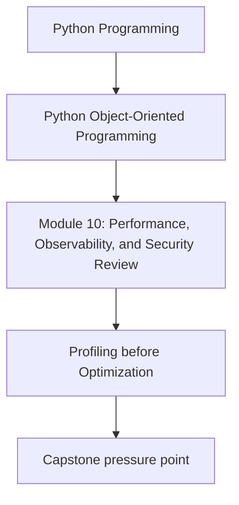
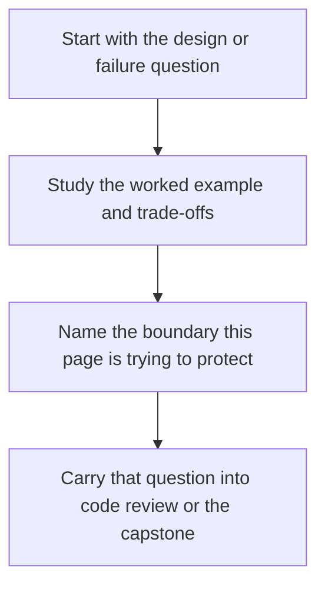

# Profiling before Optimization

<!-- page-maps:start -->
## Concept Position

<!-- page-maps:end -->

Read the first diagram as a placement map: this page is one concept inside its parent module, not a detached essay, and the capstone is the pressure test for whether the idea holds. Read the second diagram as the working rhythm for the page: name the problem, study the example, identify the boundary, then carry one review question forward.

## Purpose

Use profiling data to decide where to optimize rather than relying on intuition or style
arguments about what "must be slow."

## 1. Profilers Turn Guesses into Evidence

CPU profilers, allocation profilers, and tracing tools help answer:

- where time is spent
- where objects accumulate
- which call paths dominate latency

Without that evidence, optimization often targets the wrong code.

## 2. Read the Results in Architectural Terms

A profile is more useful when translated back into design questions:

- is the bottleneck domain logic or boundary I/O
- are we recomputing a projection too often
- is serialization dominating the request path

## 3. Optimize the Boundary That Hurts

Sometimes the answer is a faster loop.
Often the answer is fewer round-trips, less copying, or a better cache boundary.

## 4. Re-Measure after Every Meaningful Change

A successful optimization claim should include before-and-after evidence. Otherwise you
cannot tell whether the complexity you added earned its keep.

## Practical Guidelines

- Profile real workloads before changing design for speed.
- Translate profiler output into architectural causes.
- Prefer boundary and workflow improvements over speculative micro-tuning.
- Re-measure and record the result after optimization.

## Exercises for Mastery

1. Profile one representative workflow and summarize the dominant cost.
2. Explain that cost in architectural terms rather than line-by-line trivia.
3. Re-run the profile after one change and compare the results.
