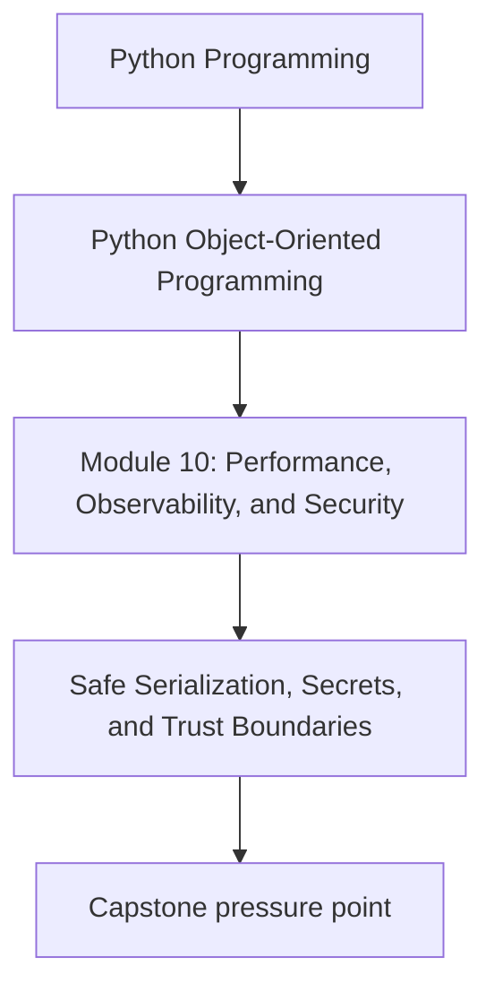
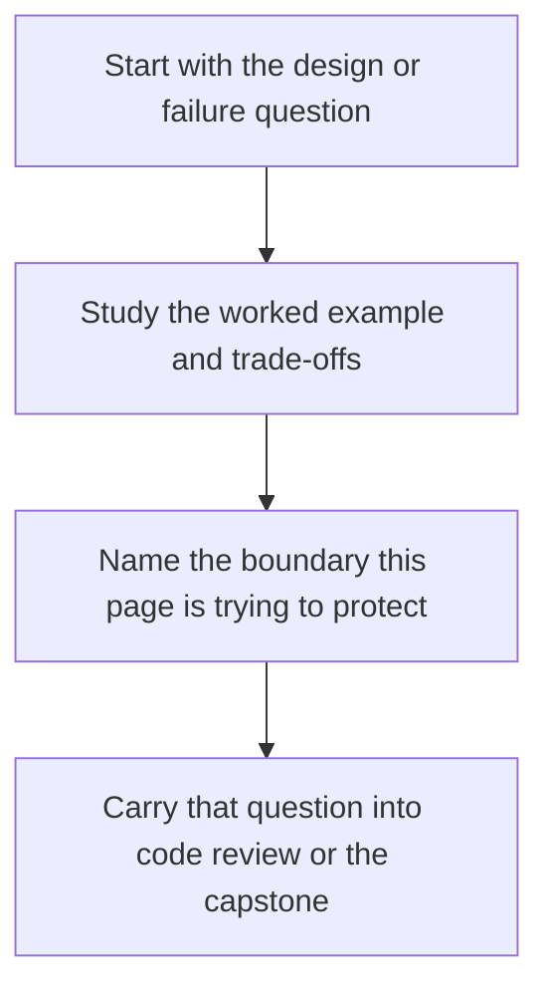

# Safe Serialization, Secrets, and Trust Boundaries

<!-- page-maps:start -->
## Concept Position

<!-- page-maps:end -->

Read the first diagram as a placement map: this page is one concept inside its parent module, not a detached essay, and the capstone is the pressure test for whether the idea holds. Read the second diagram as the working rhythm for the page: name the problem, study the example, identify the boundary, then carry one review question forward.

## Purpose

Harden serialization and logging so trusted objects do not become a path for secret
exposure or unsafe data handling.

## 1. Serialized Data Leaves the Core

Once object state is written to a file, queue, log, or response, it crosses a trust
boundary. That means representation choices affect confidentiality and safety.

## 2. Secrets Need Deliberate Handling

API keys, tokens, credentials, and sensitive identifiers should not appear in `repr`,
debug dumps, or convenience serialization by default.

## 3. Prefer Safe Formats and Explicit Codecs

Unsafe deserialization and magic object reconstruction can turn input parsing into code
execution or silent privilege expansion. Favor explicit, constrained formats.

## 4. Redaction Is Part of the Contract

If logs or snapshots must include context, decide which fields are redacted, hashed, or
omitted. Security is weakened when every caller invents its own redaction policy.

## Practical Guidelines

- Treat all serialization and logging as trust-boundary work.
- Keep secrets out of `repr`, snapshots, and default dumps.
- Prefer explicit codecs and safe formats over magical object reconstruction.
- Centralize redaction policy for sensitive fields.

## Exercises for Mastery

1. Audit one object representation for accidental secret exposure.
2. Replace one unsafe or overly magical serialization path with an explicit codec.
3. Define a redaction rule for one sensitive field used in logs or snapshots.
