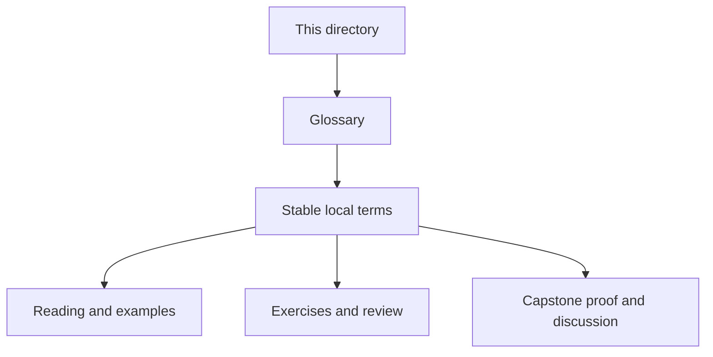
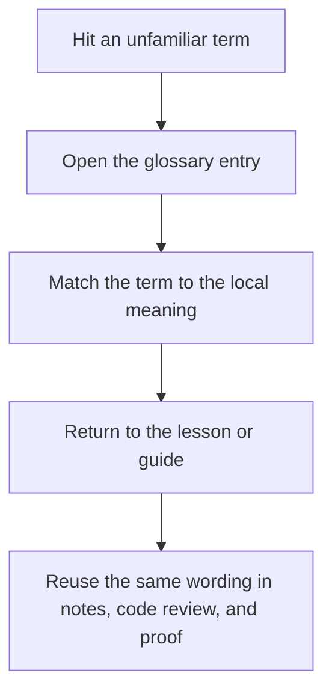

# Module Glossary

<!-- page-maps:start -->
## Glossary Fit

<!-- page-maps:end -->

This glossary belongs to **Module 10: Performance, Observability, and Security Review** in **Python Object-Oriented Programming**. It keeps the language of this directory stable so the same ideas keep the same names across reading, practice, review, and capstone proof.

## How to use this glossary

Read the directory index first, then return here whenever a page, command, or review discussion starts to feel more vague than the course intends. The goal is stable language, not extra theory.

## Terms in this directory

| Term | Meaning in this directory |
| --- | --- |
| Caching, Batching, and Lazy Work | the module's treatment of caching, batching, and lazy work, used to make the module's main design claim concrete in design work, refactoring, and capstone evidence. |
| Capstone Architecture Review | the review surface that pressure-tests the module after the first read so the learner can check judgment, not just recall. |
| Capstone Hardening and Extension Strategy | the module's treatment of capstone hardening and extension strategy, used to make the module's main design claim concrete in design work, refactoring, and capstone evidence. |
| Final Mastery Checkpoint | the exit bar for the module, used to decide whether the ideas are ready to carry forward into later design work. |
| Input Hardening and Secure Defaults | the module's treatment of input hardening and secure defaults, used to make the module's main design claim concrete in design work, refactoring, and capstone evidence. |
| Measuring Allocation Costs and Object Hot Paths | the module's treatment of measuring allocation costs and object hot paths, used to make the module's main design claim concrete in design work, refactoring, and capstone evidence. |
| Observability Signals for Object Systems | the module's treatment of observability signals for object systems, used to make the module's main design claim concrete in design work, refactoring, and capstone evidence. |
| Operational Readiness, Runbooks, and Failure Drills | the module's treatment of operational readiness, runbooks, and failure drills, used to make the module's main design claim concrete in design work, refactoring, and capstone evidence. |
| Profiling before Optimization | the module's treatment of profiling before optimization, used to make the module's main design claim concrete in design work, refactoring, and capstone evidence. |
| Safe Serialization, Secrets, and Trust Boundaries | the module's treatment of safe serialization, secrets, and trust boundaries, used to make the module's main design claim concrete in design work, refactoring, and capstone evidence. |
