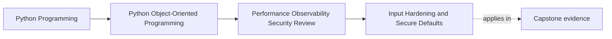
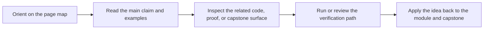

# Input Hardening and Secure Defaults

<!-- page-maps:start -->
## Page Maps

<!-- page-maps:end -->

Read the first diagram as a placement map: this page is one concept inside its parent module, not a detached essay, and the capstone is the pressure test for whether the idea holds. Read the second diagram as the working rhythm for the page: name the problem, study the example, identify the boundary, then carry one review question forward.

## Purpose

Make boundary objects and APIs reject dangerous or ambiguous input by default instead of
assuming every caller is well behaved.

## 1. Boundaries Need a Defensive Posture

Input hardening includes:

- strict schema validation
- bounded sizes and counts
- explicit enum or mode handling
- refusal of unknown dangerous combinations

This protects both correctness and security.

## 2. Defaults Should Reduce Risk

If an option can be omitted, the default should favor the safer behavior, not the most
permissive one. Convenience defaults often become long-term liabilities.

## 3. Validate Before Work Starts

Rejecting malformed or unsupported input early prevents partial side effects and makes
failure easier to diagnose.

## 4. Security and Domain Integrity Reinforce Each Other

Strong validation, semantic types, and explicit transitions reduce both accidental bugs
and several classes of exploit-friendly ambiguity.

## Practical Guidelines

- Harden boundary parsing with strict schemas and bounded input.
- Choose defaults that reduce exposure and ambiguity.
- Reject unsupported combinations before side effects begin.
- Review validation rules for both domain correctness and security value.

## Exercises for Mastery

1. Identify one permissive default in your system and propose a safer alternative.
2. Add one size, count, or mode bound to a boundary parser.
3. Review one validation rule and explain its security benefit.
