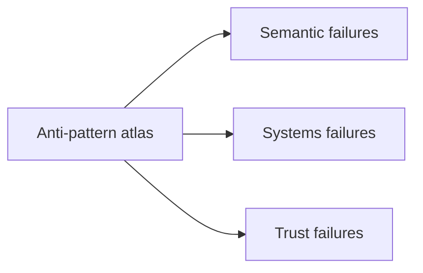
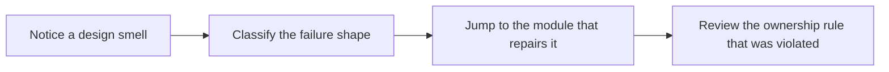

# Anti-Pattern Atlas

<!-- page-maps:start -->
## Page Maps

<!-- page-maps:end -->

Use this page when a codebase feels “object-oriented” but hard to trust. These are the
failure shapes the course is trying to prevent, grouped by the module that best repairs
them.

## Semantic failures

| Anti-pattern | Why it hurts | Repair module |
| --- | --- | --- |
| bag-of-fields class | it uses `class` syntax without a real contract for identity or behavior | Module 01 |
| mutable value used as key | containers silently become unsafe | Module 01 |
| accidental shared state | aliasing and shallow copies create non-local mutation | Module 01 |
| inheritance for convenience reuse | subclasses inherit obligations they do not want | Module 02 |
| primitive obsession | domain meaning leaks into raw strings, ints, and booleans | Module 02 |
| partial object construction | callers must remember invisible lifecycle rules | Module 03 |

## Systems failures

| Anti-pattern | Why it hurts | Repair module |
| --- | --- | --- |
| god service | orchestration absorbs domain policy, storage, and runtime logic | Module 02 |
| orphan invariant | no aggregate root clearly owns a cross-object rule | Module 04 |
| event theater | events are emitted, but no one can say what remains authoritative | Module 04 |
| cleanup lottery | resource release depends on callers remembering hidden rules | Module 05 |
| retry roulette | side effects are repeated without idempotency or compensation design | Module 05 |
| table-shaped domain | persistence records replace domain contracts | Module 06 |
| hidden session magic | identity maps, lazy loads, or writes happen outside clear boundaries | Module 06 |
| concurrency by hope | multiple workers mutate shared state without owned boundaries | Module 07 |

## Trust failures

| Anti-pattern | Why it hurts | Repair module |
| --- | --- | --- |
| assertion theater | tests repeat implementation details instead of defending contracts | Module 08 |
| public surface drift | internal modules quietly become external obligations | Module 09 |
| plugin free-for-all | extension points widen faster than the maintainer can govern | Module 09 |
| observability by logging everything | telemetry cost rises while meaning stays vague | Module 10 |
| unsafe convenience serialization | secret or hostile data crosses trust boundaries casually | Module 10 |

## How to use the atlas

- Start from the smell you can name, not the pattern you hope to apply.
- Follow the repair module and re-read its overview before diving into one chapter.
- Use the atlas during code review when “this feels wrong” is still too vague.

## First repair move by failure family

| If the failure looks like... | First repair move | First capstone surface |
| --- | --- | --- |
| a semantic contract is fuzzy | reopen the earliest module that defines the object role or lifecycle | `model.py` and the lifecycle-oriented tests |
| collaboration or runtime pressure is swallowing ownership | reopen the matching systems module before changing code | `ARCHITECTURE.md`, `runtime.py`, or `repository.py` |
| trust, public surface, or operations feel performative | reopen the matching trust module before asking for stronger proof | `TEST_GUIDE.md`, `PACKAGE_GUIDE.md`, or `PROOF_GUIDE.md` |

## When two smells seem true at once

- start with the earlier repair module, because later failures often inherit earlier ownership mistakes
- prefer the smell that changes who is authoritative over the smell that only changes tooling or visibility
- use the capstone surface named by the repair module to decide which smell is actually driving the damage

## Good signs after the repair

- You can name the owner of the rule that used to be scattered.
- You can explain which boundary is authoritative and which are derived.
- You can add or remove behavior with smaller blast radius than before.
- You can point to one proof surface that would fail first if the anti-pattern returned.

An atlas like this keeps the course honest. It proves the book is not just teaching
clean examples; it is also teaching how to recognize and repair the clumsy code people
actually inherit.
