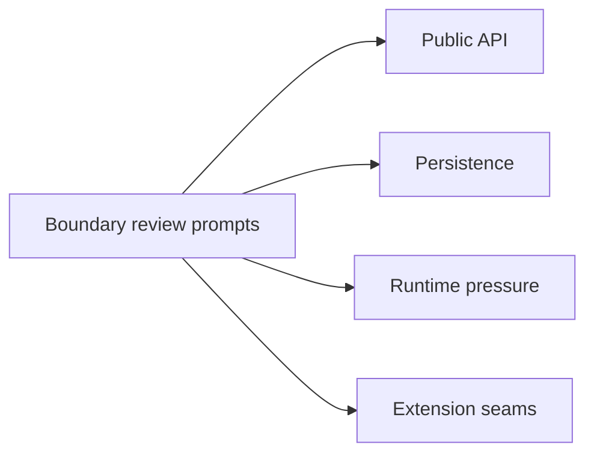
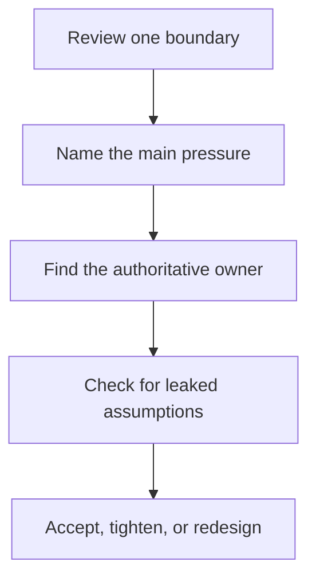

# Boundary Review Prompts

<!-- page-maps:start -->
## Page Maps

<!-- page-maps:end -->

Use these prompts when a design crosses process, time, persistence, or extension
boundaries. These are the places where object-oriented systems usually stop being
clear unless the ownership rules are made explicit.

## Public API prompts

- Which names are intentionally public, and which ones are only convenient today?
- Does the facade reflect the real domain boundary or just the current file layout?
- Are examples and commands proving the same contract the docs describe?

## Persistence prompts

- Does storage mapping preserve domain invariants, or does it bypass them?
- Which serialized shape is a contract, and how would it evolve safely?
- Where is conflict detection or rollback responsibility made visible?

## Runtime prompts

- Which object owns clocks, retries, queues, async bridges, or worker coordination?
- Does runtime orchestration coordinate the domain, or is it absorbing domain rules?
- Which behavior would become unsafe first under concurrency or cancellation pressure?

## Extension prompts

- What is the narrowest supported extension seam?
- Could a plugin or adapter mutate domain internals it should not control?
- Which review or compatibility checks would fail first if an extension broke the contract?
