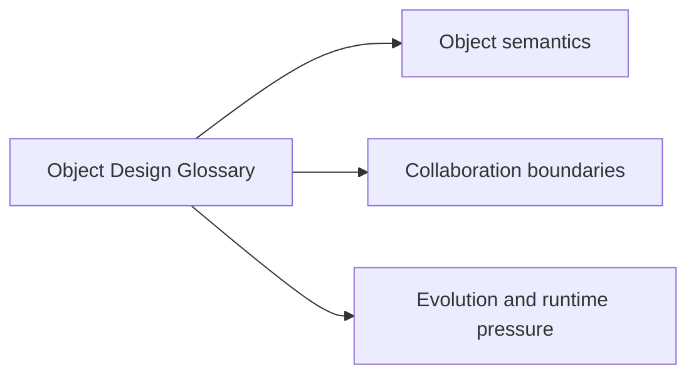
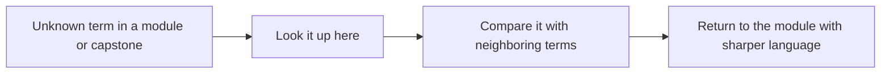

# Object Design Glossary

<!-- page-maps:start -->
## Page Maps

<!-- page-maps:end -->

Use this glossary to keep the course vocabulary stable. Advanced OOP becomes noisy fast
when teams use the same words for different ownership and lifecycle ideas.

## Object semantics

**identity**
: the stable “which specific thing is this?” property that distinguishes one object from another even when their current data matches

**value object**
: an object whose meaning comes entirely from its value, not from long-lived identity or lifecycle

**entity**
: an object with identity, lifecycle, and rules that must survive changes over time

**invariant**
: a rule that must remain true before and after every valid state transition

**semantic type**
: a small type that gives a raw primitive domain meaning and validation, such as `MetricName` instead of bare `str`

**typestate**
: a design where the legal operations depend on the current lifecycle state and illegal states are made unrepresentable or loudly rejected

## Collaboration boundaries

**aggregate**
: a consistency boundary that treats several related objects as one unit for enforcing cross-object rules

**aggregate root**
: the authoritative entry point through which an aggregate is mutated and validated

**composition root**
: the place where concrete collaborators are wired together so domain code does not assemble its own dependencies

**adapter**
: an object that translates between the domain’s contract and an external system, framework, or data shape

**projection**
: a read-optimized view derived from events or aggregate state for inspection, reporting, or query needs

**read model**
: a projection treated as a deliberate downstream surface rather than the primary source of truth

## Evolution and runtime pressure

**unit of work**
: a boundary that groups related persistence or side-effect steps so success, failure, and cleanup stay coherent

**rehydration**
: reconstructing a valid domain object or aggregate from stored data while reasserting its invariants

**public surface**
: the part of a module or object contract that callers are allowed to rely on across change

**compatibility contract**
: the explicit promise about what must continue to work as the system evolves

**runtime pressure**
: a design force such as time, concurrency, persistence, or failure handling that changes how ownership and invariants must be modeled
