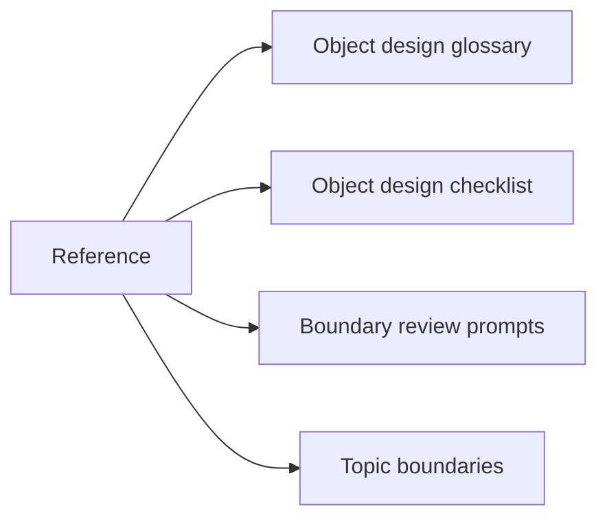
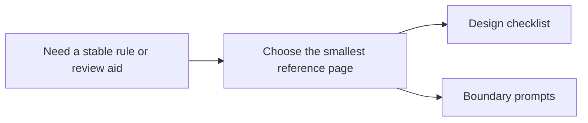

# Reference

<!-- page-maps:start -->
## Page Maps

<!-- page-maps:end -->

Use this section when you need stable review standards rather than a reading route.
These pages are meant to stay open while designing or reviewing code, not only while
reading the course front to back.

## Pages in this section

- [Object Design Glossary](glossary.md) for the recurring vocabulary around ownership, lifecycle, and collaboration boundaries
- [Object Design Checklist](object-design-checklist.md) for object-level and aggregate-level design review
- [Boundary Review Prompts](boundary-review-prompts.md) for API, persistence, runtime, and extension pressure
- [Topic Boundaries](topic-boundaries.md) for what belongs in the center of the course and what only touches its edges
- [Anti-Pattern Atlas](anti-pattern-atlas.md) for common OOP failure shapes and the modules that repair them
