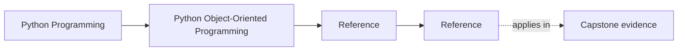
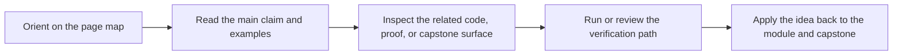

# Reference

<!-- page-maps:start -->
## Page Maps

<!-- page-maps:end -->

This shelf is for durable object-oriented vocabulary, ownership questions, and review
standards. Use it when the design pressure is already recognizable and you need a stable
reference surface for making or reviewing a boundary decision.

## Choose the right reference route

| If your question is... | Best page |
| --- | --- |
| What does this term mean locally? | [Glossary](glossary.md) |
| Where does this design pressure sit in the course sequence? | [Module Dependency Map](module-dependency-map.md) |
| What should I practice or prove next? | [Practice Map](practice-map.md) |
| How should I review this object boundary? | [Review Checklist](review-checklist.md) |
| Which sharper boundary question should I ask? | [Boundary Review Prompts](boundary-review-prompts.md) |
| How can I turn this idea into active recall? | [Self-Review Prompts](self-review-prompts.md) |
| What failure shape am I seeing? | [Anti-Pattern Atlas](anti-pattern-atlas.md) |
| What counts as genuinely complete understanding? | [Completion Rubric](completion-rubric.md) |
| Does this question belong in the course center or at its edge? | [Topic Boundaries](topic-boundaries.md) |

## What this shelf is for

- keeping ownership, lifecycle, and collaboration language stable
- reviewing object, aggregate, and extension boundaries with explicit criteria
- connecting module order to local practice and capstone proof routes
- deciding whether a boundary earns its complexity or should be simplified

## Guide set

- [Glossary](glossary.md)
- [Module Dependency Map](module-dependency-map.md)
- [Practice Map](practice-map.md)
- [Review Checklist](review-checklist.md)
- [Boundary Review Prompts](boundary-review-prompts.md)
- [Self-Review Prompts](self-review-prompts.md)
- [Anti-Pattern Atlas](anti-pattern-atlas.md)
- [Completion Rubric](completion-rubric.md)
- [Topic Boundaries](topic-boundaries.md)

## Stop here when

- you know which object or layer the current question belongs to
- you can turn that page into one explicit design judgment
- you know whether the next move is back to a module or into the capstone
