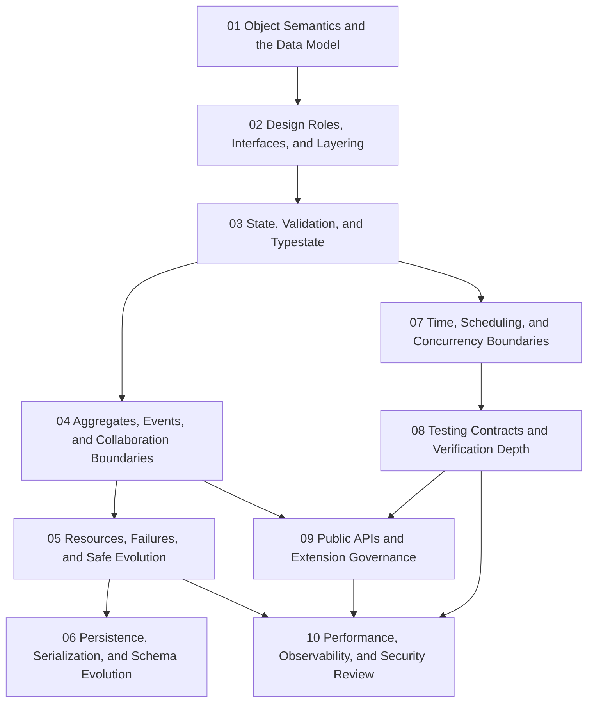

# Module Dependency Map

Use this page when you remember an object-oriented topic but not why it appears where it
does in the course. The goal is to keep later design pressures attached to earlier
ownership and semantics work.

## Main sequence

## Why the sequence looks like this

| Module | Depends most on | Reason |
| --- | --- | --- |
| 01 | none | object semantics and the data model define the vocabulary of later design work |
| 02 | 01 | roles and interfaces only matter after object shape and responsibility are visible |
| 03 | 01-02 | lifecycle and validation rules depend on stable object boundaries |
| 04 | 02-03 | aggregates and events only make sense once authority and typestate are clear |
| 05 | 03-04 | safe evolution depends on known lifecycle and collaboration boundaries |
| 06 | 03-05 | persistence should adapt to invariants that already exist |
| 07 | 03-05 | time and concurrency boundaries are safer after ownership is already disciplined |
| 08 | 01-07 | testing depth depends on knowing what the objects are actually promising |
| 09 | 02-08 | extension governance belongs late because public API pressure depends on the whole design |
| 10 | all earlier modules | final review needs semantics, boundaries, proof, and stewardship together |

## Fastest safe paths

- new learner: read Modules 01 through 10 in order
- working maintainer: start with Modules 03, 04, 08, and 09, then backfill earlier modules when ownership vocabulary feels weak
- design steward: start with Modules 04, 06, 09, and 10, then revisit earlier modules when invariants or lifecycle edges point backward
