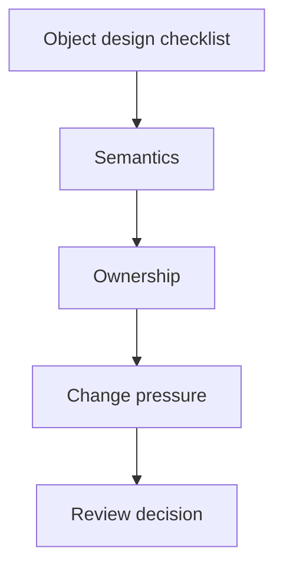

# Object Design Checklist


<!-- page-maps:start -->
## Page Maps



```mermaid
flowchart LR
  class["Review one class or aggregate"] --> meaning["What does it mean?"]
  meaning --> owner["What does it own?"]
  owner --> contract["What contract must survive change?"]
  contract --> decision["Keep, split, or redesign"]
```
<!-- page-maps:end -->

Use this checklist when reviewing any object-oriented design in the course or the
capstone. The point is not to reward “more classes.” The point is to decide whether
the current object boundary earns its existence.

## Semantics

- Is this object primarily a value, an entity, an aggregate, a policy, an adapter, or a facade?
- Would another engineer describe its role the same way after reading one file?
- Does the name reflect the contract, not just the implementation detail?

## Ownership

- Which invariant does this object own directly?
- Which state is authoritative here, and which state is only derived or cached?
- Which behavior belongs here, and which should move to orchestration or another object?

## Mutation and lifecycle

- Does the public API make legal transitions easier than illegal ones?
- Are invalid states blocked at construction or transition time instead of tolerated silently?
- Does the object expose mutation only where the ownership boundary justifies it?

## Collaboration

- Does this object depend on abstractions that match its role, or does it reach across layers?
- Would composition express this relationship more honestly than inheritance?
- If this object emits events or calls adapters, does it still preserve a clear source of truth?

## Evolution

- What would have to change if a new behavior were added tomorrow?
- Which callers would break if this object’s representation changed?
- Does the object keep compatibility pressure local, or does it widen ripple effects?
