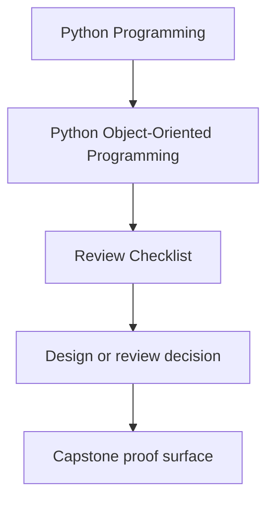
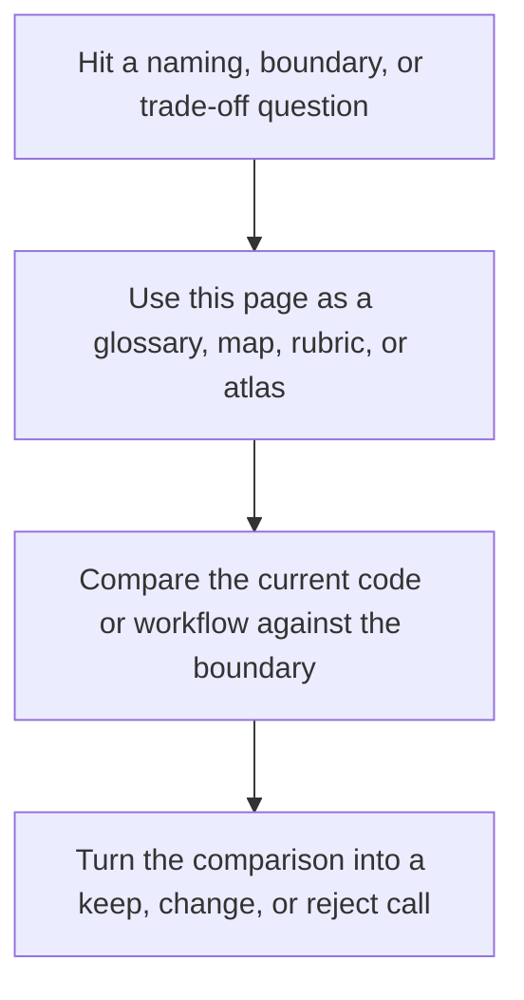

# Review Checklist

<!-- page-maps:start -->
## Reference Position

<!-- page-maps:end -->

Read the first diagram as a lookup map: this page is part of the review shelf, not a first-read narrative. Read the second diagram as the reference rhythm: arrive with a concrete ambiguity, compare the current work against the boundary on the page, then turn that comparison into a decision.

Use this checklist when reviewing any object-oriented design in the course or the
capstone. The point is not to reward “more classes.” The point is to decide whether
the current object boundary earns its existence.

## Semantics

- Is this object primarily a value, an entity, an aggregate, a policy, an adapter, or a facade?
- Would another engineer describe its role the same way after reading one file?
- Does the name reflect the contract, not just the implementation detail?

## Ownership

- Which invariant does this object own directly?
- Which state is authoritative here, and which state is only derived or cached?
- Which behavior belongs here, and which should move to orchestration or another object?

## Mutation and lifecycle

- Does the public API make legal transitions easier than illegal ones?
- Are invalid states blocked at construction or transition time instead of tolerated silently?
- Does the object expose mutation only where the ownership boundary justifies it?

## Collaboration

- Does this object depend on abstractions that match its role, or does it reach across layers?
- Would composition express this relationship more honestly than inheritance?
- If this object emits events or calls adapters, does it still preserve a clear source of truth?

## Evolution

- What would have to change if a new behavior were added tomorrow?
- Which callers would break if this object’s representation changed?
- Does the object keep compatibility pressure local, or does it widen ripple effects?

## Keep, split, or redesign signals

- keep the object if one ownership story still explains its invariants, mutation, and public contract cleanly
- split the object if two different authorities are hiding behind one convenient class name
- redesign the boundary if callers must know private sequencing, cleanup, or storage details to use it safely

## Evidence to ask for before you accept the design

- which capstone file or module example shows this role clearly
- which test or saved route would fail first if this ownership claim stopped being true
- which neighboring boundary should stay simpler because this object is carrying the right burden
