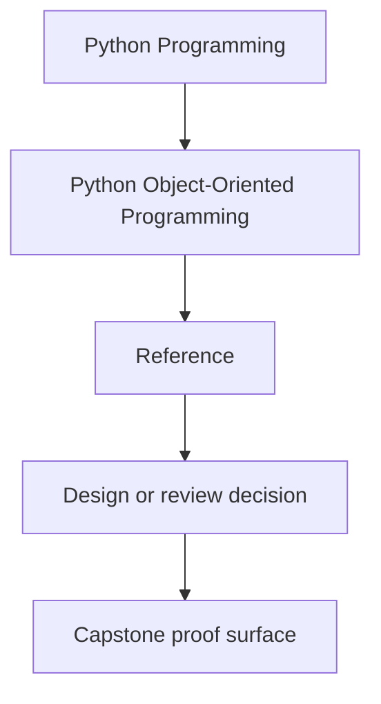
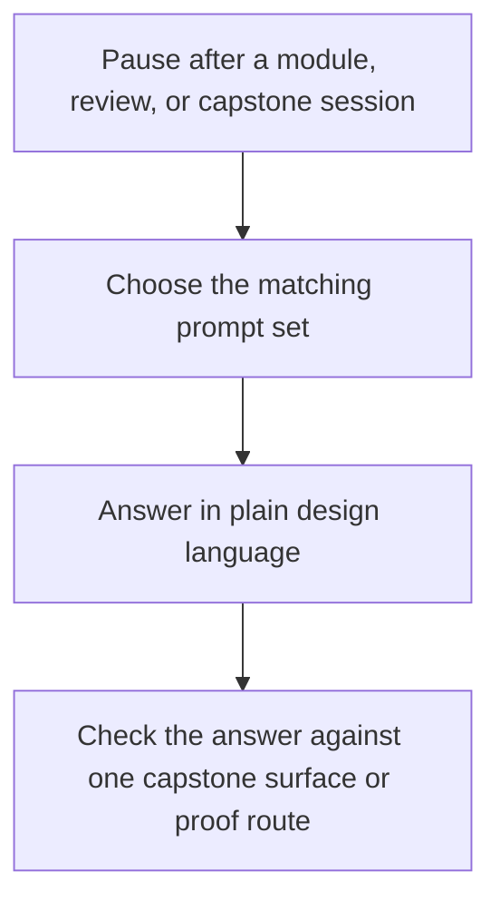

# Self-Review Prompts

<!-- page-maps:start -->
## Reference Position

<!-- page-maps:end -->

Use this page when you want retrieval practice that sharpens design judgment instead of
testing recall for its own sake. The best answers should sound like review comments or
design decisions, not like a glossary quiz.

## Semantic prompts

- What makes this object a value object, an entity, or neither?
- Which part of its contract depends on identity, and which part depends on value semantics?
- Which mutation would preserve the object's meaning, and which mutation would corrupt it?

## Ownership prompts

- Which object should own this invariant, and why is a nearby object the wrong owner?
- Where does orchestration stop and authoritative domain behavior begin?
- Which behavior would become more confusing if it moved into the runtime or adapter layer?

## Lifecycle prompts

- Which illegal state is still too easy to construct?
- What transition should be explicit in the API instead of implied by conventions?
- Which object or method should reject the invalid transition first?

## Collaboration prompts

- Which collaboration is necessary, and which one is accidental coupling?
- Where is the boundary between an authoritative object and a derived projection?
- Which event, policy, or adapter should observe the change without becoming the source of truth?

## Persistence prompts

- Which storage concern is threatening to redefine the domain model?
- What shape belongs to storage only, and what shape belongs to the domain contract?
- Which repository or codec decision would quietly flatten the model if left unreviewed?

## Runtime and proof prompts

- Which runtime pressure belongs outside the aggregate boundary?
- What is the smallest honest proof route for the current design claim?
- Which current test or bundle would fail first if the ownership model had become muddier?

## Best companion pages

- `review-checklist.md`
- `boundary-review-prompts.md`
- `anti-pattern-atlas.md`
- `topic-boundaries.md`
