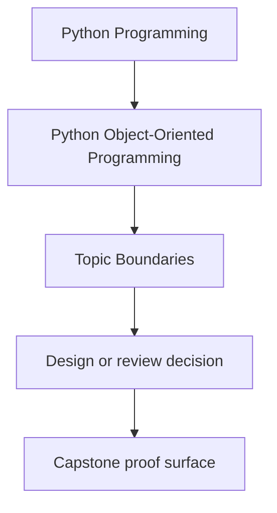
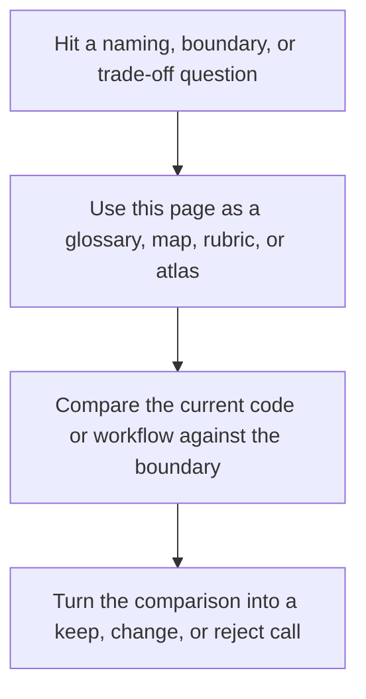

# Topic Boundaries

<!-- page-maps:start -->
## Reference Position

<!-- page-maps:end -->

Read the first diagram as a lookup map: this page is part of the review shelf, not a first-read narrative. Read the second diagram as the reference rhythm: arrive with a concrete ambiguity, compare the current work against the boundary on the page, then turn that comparison into a decision.

Use this page when you need to decide whether a topic belongs inside the center of
this course, on its edge, or outside it. That boundary matters because object-oriented
Python becomes vague fast when every runtime feature is treated as equally central.

## What this course is centrally about

These topics are the spine of the course:

- object semantics: identity, equality, aliasing, copying, and attribute lookup
- ownership and responsibility assignment across values, entities, services, and adapters
- state design: validation, typestate, null pressure, and lifecycle transitions
- collaboration boundaries: aggregates, policies, events, projections, and read models
- survivability: cleanup, failure handling, compatibility, persistence, and schema change
- runtime pressure: time, queues, threads, async boundaries, and owned mutation
- proof and governance: tests, contracts, public APIs, extension seams, observability, and security

If a question changes who owns behavior, how invariants survive, or how a boundary
remains governable under change, it belongs in the center of this course.

## Topics that are adjacent, not central

These matter, but they are supporting material rather than the main teaching target:

- type-checker details beyond what is needed for protocols, contracts, and object design
- ORM or framework APIs beyond the design pressure they introduce
- database indexing, SQL tuning, and deployment mechanics
- low-level performance tuning after the ownership model is already correct
- distributed systems patterns that go far beyond the in-process or single-service boundary

The course should mention these when they alter object design decisions, but it should
not turn into a framework catalog or infrastructure manual.

## Topics that are outside the course center

These are not the main subject here:

- beginner syntax for `class`, `self`, inheritance, or decorators
- full meta-programming coverage of descriptors, `__init_subclass__`, or metaclasses
- functional-programming-first design beyond the places where OOP and FP choices meet
- database administration, deployment pipelines, or cloud operations
- broad secure-coding coverage unrelated to object boundaries or serialization trust

Those topics can be important, but they are not where this course should spend most
of its depth budget.

## Common boundary confusions

| Confusion | Better boundary |
| --- | --- |
| “OOP means class syntax and design patterns.” | OOP here means explicit ownership, invariants, and change boundaries. |
| “If a framework uses classes, the framework itself is the curriculum.” | Frameworks are examples of pressure, not the subject. |
| “Persistence is a storage topic, not an object-design topic.” | Persistence belongs here because storage can corrupt or preserve domain contracts. |
| “Concurrency is infrastructure, not OOP.” | Concurrency belongs here when it changes ownership, mutation, and lifecycle guarantees. |
| “Security is separate from OOP.” | Security belongs here when trust boundaries, serialization, or public APIs change the object contract. |

## How to use this boundary in practice

- Stay in this course when the question is “who should own this rule?”
- Stay in this course when the question is “what should remain authoritative under change?”
- Use an adjacent source when the question is mostly framework commands or vendor specifics.
- Leave the course center when the question is beginner syntax or deep meta-programming internals.

The course becomes clearer when its topic boundary is explicit. That clarity is what
lets the module sequence stay coherent instead of feeling like a bag of advanced Python topics.
