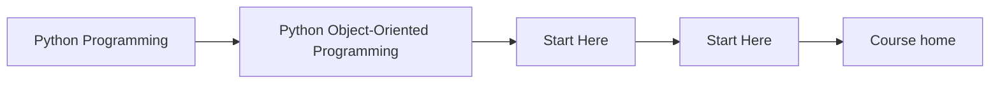
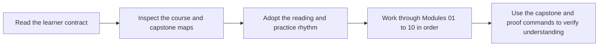

# Start Here

<!-- page-maps:start -->
## Page Maps

<!-- page-maps:end -->

This page is the shortest honest route into the course. Read it before browsing the
module tree. The subject is not class syntax. The subject is how Python object models
stay coherent when they carry state, invariants, collaboration, persistence, and runtime
pressure for a long time.

## What this course is really teaching

The course teaches object-oriented Python as a discipline of ownership:

- which object owns an invariant
- which boundary is authoritative
- which behavior belongs in orchestration instead of the domain
- which changes should stay local instead of rippling across the system

If you keep those questions in view, the modules feel cumulative instead of scattered.

## Best reading route

1. Read [Course Home](index.md) for the course promise and module arc.
2. Read [Orientation](module-00-orientation/index.md) and [Course Map](module-00-orientation/course-map.md) for the full structure.
3. Read [Learning Contract](learning-contract.md) before you start Module 01.
4. Keep [Capstone](capstone.md) open while reading Modules 04 to 10.
5. Use [Command Guide](command-guide.md) whenever you want to check the executable surface.

## What to avoid

- jumping into advanced modules without the earlier semantic foundation
- treating the capstone as an optional appendix
- reading the chapters as pattern trivia instead of ownership decisions
- assuming a class hierarchy is progress by itself

## Success signal

You are using the course correctly if each module makes one design question easier to
answer in the capstone: what changed, who should own it, and why that owner is the least
surprising place for the behavior to live.
