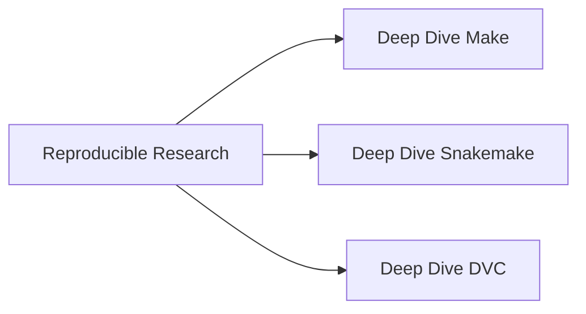
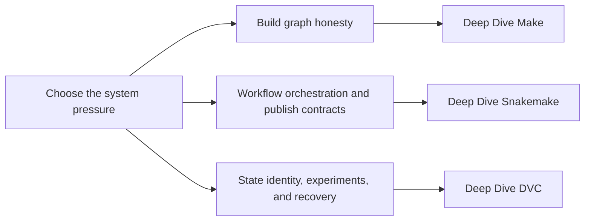

# Reproducible Research

<section class="bijux-hero">
  
Program Family

  <h1 class="bijux-hero__title">Choose the workflow model that matches the failure you need to fix.</h1>
  
This family collects programs about reproducibility, workflow truth, data state, and publication boundaries. The goal is not to organize tools by popularity. The goal is to help a reader choose the system model that matches the failure mode they need to fix.

  

    Build graphs
    Workflow orchestration
    State identity
    Recovery
  

</section>

<strong>Route by system pressure first.</strong> These programs overlap in tooling territory, but they do not solve the same trust problem. Start from the failure mode that is hurting you now, then move into the one course that owns that pressure honestly.

  <a class="md-button md-button--primary" href="deep-dive-make/course-book/index.md">Open Deep Dive Make</a>
  <a class="md-button" href="deep-dive-snakemake/course-book/index.md">Open Deep Dive Snakemake</a>
  <a class="md-button" href="deep-dive-dvc/course-book/index.md">Open Deep Dive DVC</a>

## Family Map

Read the first diagram as the family shape. Read the second diagram as the selection
route: choose the pressure first, then open the course that owns that pressure.

## Choose a Program

| If your pressure is... | Start here | What this program sharpens |
| --- | --- | --- |
| dependency truth, rebuild behavior, publication layout, and build repair | [Deep Dive Make](deep-dive-make/course-book/index.md) | graph honesty, target design, portability, release-safe build boundaries |
| file contracts, workflow orchestration, profiles, and downstream publish surfaces | [Deep Dive Snakemake](deep-dive-snakemake/course-book/index.md) | workflow structure, policy boundaries, file APIs, operational review |
| data identity, params, metrics, experiments, and promotion or recovery discipline | [Deep Dive DVC](deep-dive-dvc/course-book/index.md) | state contracts, experiment meaning, registry boundaries, trustworthy recovery |

  

    <h3><a href="deep-dive-make/course-book/index.md">Deep Dive Make</a></h3>
    
Use this program when you need graph honesty, rebuild trust, target design clarity, and portable publication boundaries.

  

  

    <h3><a href="deep-dive-snakemake/course-book/index.md">Deep Dive Snakemake</a></h3>
    
Use this program when orchestration policy, file contracts, workflow scale, and downstream publication surfaces are the main pressure.

  

  

    <h3><a href="deep-dive-dvc/course-book/index.md">Deep Dive DVC</a></h3>
    
Use this program when experiment state, metrics, parameters, recovery, and promotion discipline are the real trust boundary.

  

## Stable Entry Routes

### [Deep Dive Make](deep-dive-make/course-book/index.md)

- Learner entry: [Start Here](deep-dive-make/course-book/guides/start-here.md)
- Program guide: [Course Guide](deep-dive-make/course-book/guides/course-guide.md)
- Pressure route: [Pressure Routes](deep-dive-make/course-book/guides/pressure-routes.md)
- Capstone guide: [Capstone docs](deep-dive-make/capstone/docs/index.md)

### [Deep Dive Snakemake](deep-dive-snakemake/course-book/index.md)

- Learner entry: [Start Here](deep-dive-snakemake/course-book/guides/start-here.md)
- Program guide: [Course Guide](deep-dive-snakemake/course-book/guides/course-guide.md)
- Pressure route: [Pressure Routes](deep-dive-snakemake/course-book/guides/pressure-routes.md)
- Capstone guide: [Capstone docs](deep-dive-snakemake/capstone/docs/index.md)

### [Deep Dive DVC](deep-dive-dvc/course-book/index.md)

- Learner entry: [Start Here](deep-dive-dvc/course-book/guides/start-here.md)
- Program guide: [Course Guide](deep-dive-dvc/course-book/guides/course-guide.md)
- Pressure route: [Pressure Routes](deep-dive-dvc/course-book/guides/pressure-routes.md)
- Capstone guide: [Capstone docs](deep-dive-dvc/capstone/docs/index.md)

## How to Use This Family

- Start with the program whose pressure description matches the system problem you need to review.
- Return to this page when two tools seem similar but the trust boundary is different.
- Use the capstone guide after the course model is clear, not as the first explanation.
- Keep this page aligned with the real learner entry routes whenever programs grow or move.
