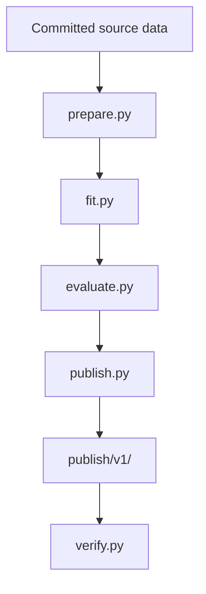
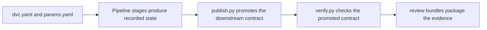

# Capstone Architecture

<!-- page-maps:start -->
## Guide Maps

<!-- page-maps:end -->

This capstone is intentionally small, but its architecture is strict. The learner goal is
to see where state is declared, where it is recorded, where it is promoted, and where it
is verified.

## Ownership boundaries

### Repository contract

- `README.md` explains the repository promise.
- `dvc.yaml` declares the workflow.
- `dvc.lock` records executed state.

### Pipeline implementation

- `prepare.py` normalizes rows and produces the split profile.
- `fit.py` trains the reference classifier.
- `evaluate.py` produces metrics and predictions.
- `publish.py` writes the downstream review bundle.
- `verify.py` checks whether the promoted bundle satisfies the release contract.

Use [STAGE_CONTRACT_GUIDE.md](STAGE_CONTRACT_GUIDE.md) when the next question is not
only which file owns a behavior, but which DVC stage boundary should own it.

### Review surfaces

- `publish/v1/` is the promoted downstream interface.
- `PUBLISH_CONTRACT.md` explains what each promoted file means.
- walkthrough, tour, release, experiment, and recovery bundles package different review questions.

## Why this architecture matters

The course is about authority and evidence. This capstone only teaches that well if the
learner can point to the exact file that owns declaration, execution, promotion, or
verification.

Use [SOURCE_GUIDE.md](SOURCE_GUIDE.md) when the architecture is clear but the learner
still needs the fastest exact route from one question to one file and proof surface.
