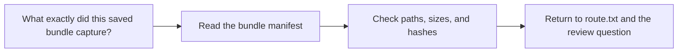

# Bundle Manifest Guide

<!-- page-maps:start -->
## Guide Maps

<!-- page-maps:end -->

Use this guide when a saved bundle exists and you want to review its inventory before
opening each file manually. The goal is to make the capstone's saved evidence bundles
explicitly auditable.

## What the bundle manifest owns

| Responsibility | Owning surface |
| --- | --- |
| stable file enumeration for a saved bundle | `scripts/write_bundle_manifest.py` |
| file sizes for saved review artifacts | bundle `manifest.json` |
| SHA-256 hashes for saved review artifacts | bundle `manifest.json` |

## Best companion routes

- use `make walkthrough` when you need the first-read bundle
- use `make tour` when you need the executed proof bundle
- use `make verify-report`, `make release-review`, `make experiment-review`, or `make recovery-review` when the saved evidence question is narrower
