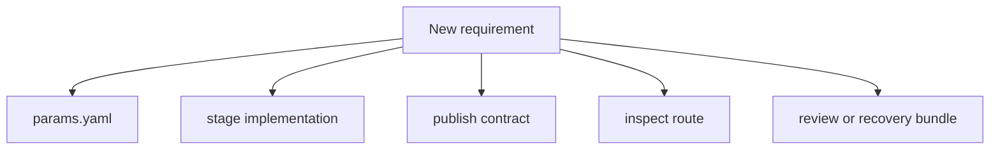
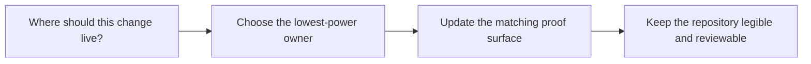

# Change Placement Guide

<!-- page-maps:start -->
## Guide Maps

<!-- page-maps:end -->

Use this guide when a new requirement seems valid but it is not yet obvious where it
belongs. The goal is to keep the capstone honest by choosing the smallest ownership
surface that can carry the change.

## Preferred owners

| If the change is about... | Prefer this owner | First proof surface |
| --- | --- | --- |
| split, training, or decision policy | `params.yaml` | `dvc.yaml`, `dvc.lock`, and `CONTROL_SURFACE_GUIDE.md` |
| data normalization or stage computation | `prepare.py`, `fit.py`, `evaluate.py`, or `publish.py` | matching unit test plus `make stage-summary` or `make verify` |
| downstream trust and promoted meaning | `PUBLISH_CONTRACT.md` and `publish.py` | `make release-review` and `make verify` |
| learner-facing summaries | `inspect.py` | `tests/test_inspect.py` and the matching Make target |
| saved audit evidence | review-bundle targets and `scripts/write_bundle_manifest.py` | saved bundle `manifest.json` plus bundle tests |
| durability and restore guarantees | recovery targets and `RECOVERY_GUIDE.md` | `make recovery-drill` or `make recovery-review` |

## Escalation rules

1. Change `params.yaml` before adding hidden constants to Python code.
2. Change one stage implementation before broadening the publish contract.
3. Change the publish contract only when the downstream reviewer truly needs the new fact.
4. Add or widen an inspect route only when a real review question is still hard to answer.
5. Add bundle content only when it improves later review, not just because it exists locally.

## What this guide prevents

- hiding control-surface changes in code
- using the publish bundle as a substitute for the full repository story
- adding broad review bundles when one narrower route would stay clearer
- teaching DVC as a pile of commands instead of a system of ownership decisions
