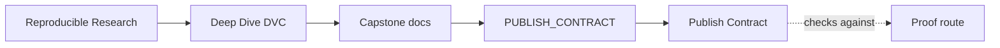
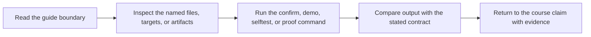

# Publish Contract

<!-- page-maps:start -->
## Guide Maps

<!-- page-maps:end -->

`publish/v1/` is the stable downstream interface for this DVC capstone. It is smaller
than the full repository on purpose: downstream reviewers should not need the entire
internal training story to understand what was promoted.

## Published files

| File | Meaning | Why it belongs in the promoted contract |
| --- | --- | --- |
| `data-profile.json` | row counts and dataset profile from the split step | it explains what population the evaluation summarizes |
| `metrics.json` | accuracy, precision, recall, f1, threshold, and eval row count | it is the first quantitative review surface |
| `model.json` | trained model coefficients and metadata | it preserves the promoted scoring behavior |
| `params.yaml` | promoted split, training, and decision parameters | it keeps the semantic control surface explicit |
| `predictions.csv` | eval predictions with identifiers and outcomes | it supports spot checks on real records |
| `report.md` | human-readable summary of the promoted state | it gives a concise review surface without forcing raw file inspection |
| `manifest.json` | promoted inventory with hashes and training summary | it binds the release boundary into one auditable record |

## What this contract is not

`publish/v1/` is not:

- the entire internal repository history
- a substitute for `dvc.lock`
- a full experiment log
- proof that the local cache is durable

Those questions still belong to the wider repository and its recorded execution state.

## Best review route

Use this order:

1. `manifest.json`
2. `params.yaml`
3. `metrics.json`
4. `report.md`
5. `predictions.csv`
6. `data-profile.json`
7. `release-summary.json` from the tour or release review bundle when you want the compact review surface

That route moves from contract inventory into control surface, then into evaluation, then
into record-level evidence.
