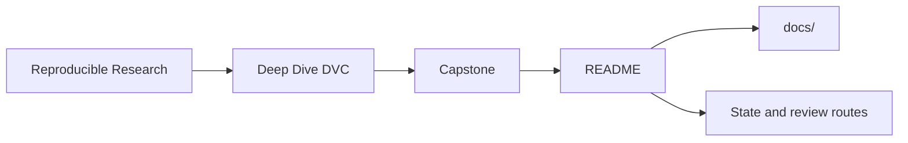
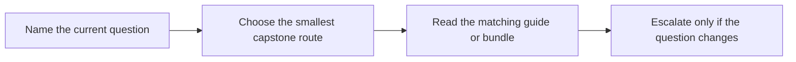

# Deep Dive DVC Capstone

<!-- page-maps:start -->
## Guide Maps




<!-- page-maps:end -->

Read the first diagram as the capstone shape. Read the second diagram as the entry rule:
choose the smallest route that answers the current question, then escalate only when the
question changes.

This capstone is the executable reference repository for Deep Dive DVC. It turns the
course's claims about state identity, truthful pipelines, params, metrics, experiments,
promotion, and recovery into one repository that can be inspected end to end. It is not
meant to be a first-contact playground for DVC commands.

## Use this capstone when

- the module idea is already legible and you want executable corroboration
- you need one repository that keeps declaration, recorded state, and promoted contract visible together
- you are reviewing whether a small DVC repository can survive release and recovery pressure honestly

## Do not use this capstone when

- state layers still feel abstract
- you want to browse the whole repository before naming a question
- the strongest proof route feels safer than choosing the right one

## Choose the entry route by question

| If the question is... | Start here | Escalate only if needed |
| --- | --- | --- |
| what this repository promises | `make walkthrough` | `make tour` |
| does the current state still match the declared contract | `make verify` | `make confirm` |
| how should I compare experiment candidates | `make experiment-review` | `make confirm` |
| what survives cache loss and remote restore | `make recovery-review` | `make confirm` |
| what is safe for downstream trust | `make release-review` | `make confirm` |

From the repository root, the matching course-level commands are:

```sh
make PROGRAM=reproducible-research/deep-dive-dvc capstone-walkthrough
make PROGRAM=reproducible-research/deep-dive-dvc capstone-verify
make PROGRAM=reproducible-research/deep-dive-dvc capstone-release-review
```

## First honest pass

1. Run `make walkthrough`.
2. Read [INDEX.md](docs/index.md).
3. Read [DOMAIN_GUIDE.md](docs/domain-guide.md).
4. Read [STAGE_CONTRACT_GUIDE.md](docs/stage-contract-guide.md).
5. Read [PUBLISH_CONTRACT.md](docs/publish-contract.md).
6. Read `dvc.yaml`, `dvc.lock`, and `params.yaml`.
7. Run `make verify`.
8. Read [RELEASE_REVIEW_GUIDE.md](docs/release-review-guide.md) and [REVIEW_ROUTE_GUIDE.md](docs/review-route-guide.md).

Stop there first. That is enough to see the domain, state boundaries, pipeline contract,
and one bounded proof route without turning the capstone into a browsing exercise.

## What the main targets prove

| Target | What it proves | Why it matters |
| --- | --- | --- |
| `walkthrough` | the learner-facing reading route is bounded and explicit | first capstone contact stays humane |
| `verify` | the current repository state matches the declared contract | proof starts from state truth, not presentation |
| `tour` | the executed proof bundle can be reviewed in one place | learners can inspect the evidence path end to end |
| `experiment-review` | changed params can be compared without mutating baseline meaning | experiments stay bounded |
| `release-review` | the promoted bundle is smaller and clearer than the internal repository | downstream trust has a contract |
| `recovery-review` | remote-backed restoration can be reviewed as evidence, not folklore | recovery is inspectable |
| `confirm` | the strongest built-in review route still passes | final review is stronger than first-pass learning |

## Repository shape

Use these surfaces deliberately:

- `data/raw/` for committed source data
- `dvc.yaml` and `dvc.lock` for declared versus recorded pipeline state
- `params.yaml` for the declared control surface
- `metrics/` for recorded evaluation surfaces
- `publish/v1/` for the downstream release boundary
- `src/incident_escalation_capstone/` for implementation
- `docs/` for bounded review routes

## Capstone docs

All capstone documentation lives under `docs/`:

- [ARCHITECTURE.md](docs/architecture.md)
- [DOMAIN_GUIDE.md](docs/domain-guide.md)
- [EXPERIMENT_GUIDE.md](docs/experiment-guide.md)
- [INDEX.md](docs/index.md)
- [PUBLISH_CONTRACT.md](docs/publish-contract.md)
- [RECOVERY_GUIDE.md](docs/recovery-guide.md)
- [RELEASE_REVIEW_GUIDE.md](docs/release-review-guide.md)
- [REVIEW_ROUTE_GUIDE.md](docs/review-route-guide.md)
- [STAGE_CONTRACT_GUIDE.md](docs/stage-contract-guide.md)
- [TOUR.md](docs/tour.md)

## Good stopping point

Stop when you can name:

- the current state question
- the smallest route that proves it
- the next stronger route only if the current one stops being enough
