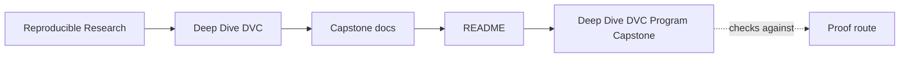
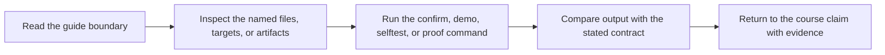

# Deep Dive DVC Program Capstone


<!-- page-maps:start -->
## Guide Maps




<!-- page-maps:end -->

This repository is the executable proof surface for **Deep Dive DVC**. It turns the
program’s claims about state identity, truthful pipelines, declared parameters, tracked
metrics, experiments, promotion, and recovery into a small DVC repository that can be
inspected end to end.

The project models a service-operations problem: predict whether a production incident
will escalate based on backlog age, reopen history, integration breadth, customer tier,
weekend handoff, and severity.

## Who should start here

Start here if you already understand the course concept you are studying and now want to
inspect it in a realistic DVC repository.

Do **not** start here if state layers, pipeline truth, or publish boundaries still feel
abstract. In that case, use the course modules first and come back when you want a proof
surface rather than first exposure.

## Where this capstone fits in the program

Use this repository lightly in the early modules and heavily once the program reaches
pipeline truth, experiments, promotion, and recovery:

- Modules 01-03 explain why state identity matters before a full repository becomes the main teaching surface.
- Modules 04-06 use this repository to inspect truthful stage edges, params, metrics, and experiment comparisons.
- Modules 07-09 use this repository to inspect reviewability, promotion evidence, publish contracts, and remote-backed recovery.
- Module 10 uses this repository as a review specimen for governance, migration, and tool-boundary judgment.

If you arrived here from the course-book, keep these course pages open beside the
repository:

- `course-book/guides/readme-capstone.md`
- `course-book/guides/capstone-map.md`
- `course-book/guides/repository-layer-guide.md`
- `course-book/reference/verification-route-guide.md`

## What lives here

- `data/raw/service_incidents.csv` is the committed source dataset.
- `DOMAIN_GUIDE.md` explains the incident-escalation domain and column meanings before the pipeline route starts.
- `STAGE_CONTRACT_GUIDE.md` explains what each DVC stage owns and what should not cross that boundary.
- `STATE_LAYER_GUIDE.md` explains which repository surface is authoritative for source, recorded, promoted, and remote-backed state.
- `CONTROL_SURFACE_GUIDE.md` explains which params changes stay comparable and how to interpret the resulting metrics.
- `BUNDLE_MANIFEST_GUIDE.md` explains the saved review-bundle inventory and how to audit it.
- `SOURCE_GUIDE.md` gives the exact file route for common capstone questions.
- `CHANGE_PLACEMENT_GUIDE.md` explains where new requirements belong in params, stages, publish, inspect, or recovery surfaces.
- `DATA_PROFILE_GUIDE.md` explains how to read the promoted population summary before trusting metrics.
- `MODEL_GUIDE.md` explains how to read the promoted scoring artifact before trusting release conclusions.
- `PREDICTION_REVIEW_GUIDE.md` explains how to review promoted row-level outcomes, mistakes, and borderline cases.
- `src/incident_escalation_capstone/` contains the pipeline implementation.
- `params.yaml` is the declared control surface for splitting, training, and decision policy.
- `dvc.yaml` and `dvc.lock` define and prove the pipeline execution graph.
- `metrics/` contains recorded evaluation surfaces.
- `publish/v1/` is the stable external contract generated by the pipeline.
- `PUBLISH_CONTRACT.md` explains why each promoted file exists and what it is safe to trust.
- `ARCHITECTURE.md` explains the file-level ownership boundaries.
- `EXPERIMENT_GUIDE.md` explains how to compare changed runs without muddying the baseline.
- `RECOVERY_GUIDE.md` explains the remote-backed restore route.
- `RELEASE_REVIEW_GUIDE.md` explains how to review `publish/v1/` as a downstream contract.
- `TOUR.md` explains how to read the proof bundle after a run.

## What this capstone is proving

This repository is intentionally small, but it still has to prove real DVC design
claims:

- source data and derived state are clearly separated
- the execution graph names the meaningful dependencies, outputs, params, and metrics
- experiments can vary the declared control surface without mutating the baseline contract
- promoted outputs have a stable publish boundary another person can review
- a cache-loss drill can restore the repository from remote-backed state

If those properties are not legible here, the larger program’s claims should be treated
with suspicion.

## Recommended first walkthrough

Use this order the first time you enter the capstone:

1. `make walkthrough`
2. read `README.md`
3. read `DOMAIN_GUIDE.md`
4. read `STAGE_CONTRACT_GUIDE.md`
5. read `STATE_LAYER_GUIDE.md`
6. read `CONTROL_SURFACE_GUIDE.md`
7. read `ARCHITECTURE.md`
8. read `dvc.yaml`
9. read `dvc.lock`
10. read `params.yaml`
11. run `make state-summary`
12. run `make verify`
13. run `make release-review`
14. inspect `publish/v1/manifest.json`
15. read `DATA_PROFILE_GUIDE.md`
16. read `MODEL_GUIDE.md`
17. read `PREDICTION_REVIEW_GUIDE.md`
18. read `PUBLISH_CONTRACT.md`

That route keeps the learner focused on contract first, then declared state, then
recorded state, then promoted evidence.

## Core workflow

From this directory:

```bash
make repro
```

That pipeline will:

1. validate and split the incident dataset into deterministic train and eval partitions
2. train a compact logistic classifier
3. evaluate it into tracked metrics and predictions
4. publish a versioned artifact bundle with a manifest and report

Use `dvc exp run` when you want to vary `params.yaml` without overwriting the baseline
state story.

## Best verification entrypoints

Run these from this directory:

```bash
make verify
make verify-report
make state-summary
make stage-summary
make release-summary
make review-queue
make threshold-review
make experiment-review
make release-review
make confirm
make recovery-drill
make recovery-review
make tour
```

Or use the repository root when you want stable program-level entrypoints:

```bash
make PROGRAM=reproducible-research/deep-dive-dvc capstone-verify
make PROGRAM=reproducible-research/deep-dive-dvc capstone-confirm
```

These commands answer different questions:

- `make verify` checks that the current repository state matches the expected contract.
- `make verify-report` writes a structured verification report under `artifacts/proof/reproducible-research/deep-dive-dvc/verify/`.
- `make stage-summary` renders the declared and recorded stage contract in one learner-facing summary.
- `make threshold-review` renders borderline promoted predictions near the current decision threshold.
- `make confirm` reruns the broader confirmation flow that the course points learners to.
- `make recovery-drill` proves that a remote-backed restore still works after local loss.
- `make experiment-review` writes a comparison bundle under `artifacts/review/reproducible-research/deep-dive-dvc/experiments/`.
- `make release-review` writes a focused release-boundary bundle under `artifacts/audit/reproducible-research/deep-dive-dvc/`.
- `make recovery-review` writes a durable bundle for the remote-backed restore under `artifacts/audit/reproducible-research/deep-dive-dvc/recovery/`.
- `make walkthrough` writes the learner-first reading bundle under `artifacts/walkthrough/reproducible-research/deep-dive-dvc/`.
- `make tour` writes a learner-facing proof bundle under `artifacts/tour/reproducible-research/deep-dive-dvc/`.

Every generated bundle now includes a `manifest.json` inventory so review can start from
an explicit file list instead of manual guessing.

The walkthrough bundle now includes the verifier implementation, verifier tests, and a
sample promoted manifest/report so the learner can connect declaration, enforcement, and
published evidence in one reading route.

It now also includes the stage guides, the main stage implementations, and the matching
inspection and preparation tests so the learner can review the repository in stage order
without reconstructing that file route by hand.

If you are unsure which route fits your question, use
`course-book/reference/verification-route-guide.md` before defaulting to the strongest
command.

If you are still unsure, use this escalation order:

1. `make tour`
2. `make verify`
3. `make verify-report`
4. `make experiment-review` or `make recovery-review` or `make release-review`
5. `make confirm`

## What `confirm` proves

`make confirm` is the strongest built-in verification target in this repository.

It combines:

* `make verify` for promoted artifact contract validation
* `make test` for code-level behavior checks
* `make recovery-drill` for remote-backed restoration after local loss

That means `confirm` is not just a smoke test. It is the shortest path to asking whether
the repository can still defend and restore its state honestly.

## Definition of done

- `make verify` confirms the promoted artifact contract for the current repository state.
- `make verify-report` writes the saved verification bundle under `artifacts/proof/reproducible-research/deep-dive-dvc/verify/`.
- `make release-review`, `make experiment-review`, and `make recovery-review` each write the narrower audit bundle they promise.
- `make confirm` completes the strongest built-in verification route, including recovery.
- `make tour` produces the learner-facing proof bundle for repository review.

## How to review this repository

When inspecting the capstone, ask:

- which state is authoritative and which state is merely derived
- whether `dvc.yaml` and `dvc.lock` tell the same truthful story
- whether metrics and params are still semantically comparable across runs
- whether `publish/v1/` is small and stable enough for downstream trust
- which guarantees survive if the local cache disappears today
